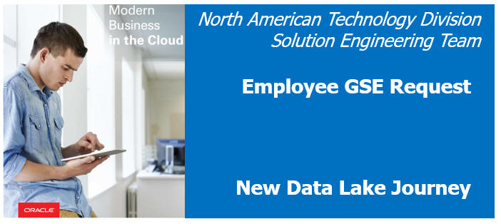 

Updated: June 5, 2017

## Introduction

Oracle offers a set of Big Data Journeys to help users get started using Oracle Cloud services with a purpose.  These journeys are available to everyone at `http://www.oracle.com/bigdatajourney`

Oracle Solution Engineers may use these journeys to build hands-on technical skills with Oracle Big Data Cloud Services.  Additionally, Solution Engineers may use the journeys to work collaboratively with customers.
Demo Central – powered by Oracle Global Solution Engineering (GSE) - offers a MetCS (Metered Cloud Service) Stack of preconfigured cloud services in the Oracle Public Cloud for Solutions Engineers to use for workshops, demonstrations and proof of concepts.
As of the date of this publication, a GSE engineer must manually configure a demo environment that has all cloud services necessary to run Big Data Journeys

This guide is intended to help Oracle Solution Engineers set up an Oracle Big Data Cloud Service – Compute Edition environment in Demo Central so they may run through the Big Data Journeys available for clients and prospects

# Steps
- Register a Demo with Demo Central
- Launch the Demo Environment
- Customize Your Dashboard to Display Additional Services
- Verify the Storage Cloud Service and Storage Container are Created
- Verify the Big Data Cloud Service – Compute Edition Service is Created
- Begin Your Big Data Journey

## Register a Demo with Demo Central
1)	Visit Demo Central at `http://demo.oracle.com`
2)	Click “Demos” tab
3)	Click “Register a Demo” button
4)	Search for “Big Data Cloud Service Compute Edition (BDCS CE) with Zeppelin”
5)	Complete the Demo Registration form using the following values:
-	Demo Purpose: “Personal Learning”
-	Description/Comments: “Walk through Big Data Journeys”
-	Demo Resource Request Type: “A new Deal Server Environment”	
-	Activity Start Date:  <your start date>
-	Activity End Date:  <your end date>
-	Demo Date(s):  <your demo date>

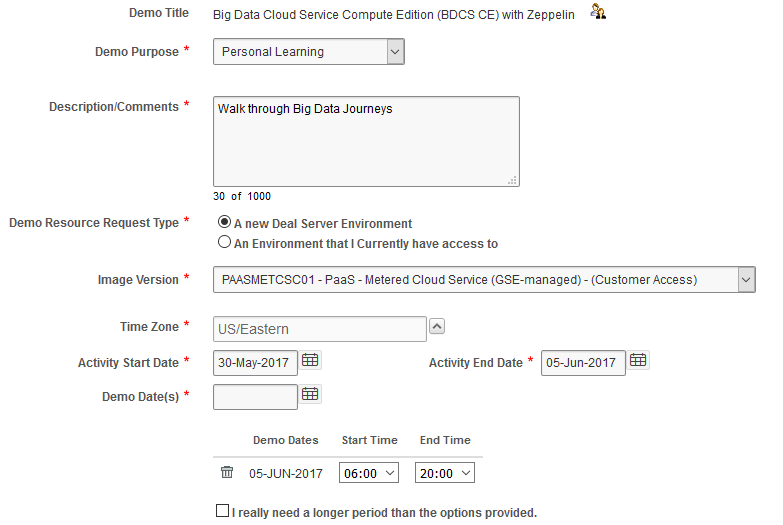  

6)	Click “Next” button
7)	Select “Horizontal (NOT Industry-Specific)”
8)	Check the “Big Data - Compute Edition” checkbox

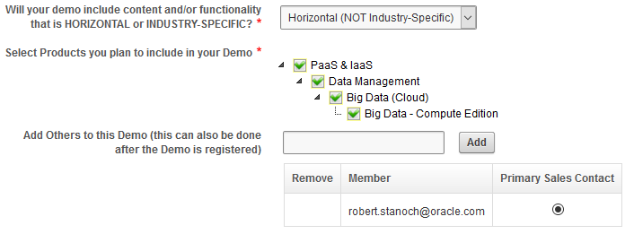  

9)	Click “Next” button
10)	Click “Submit” button
11)	You will automatically receive an email notification like the one below:

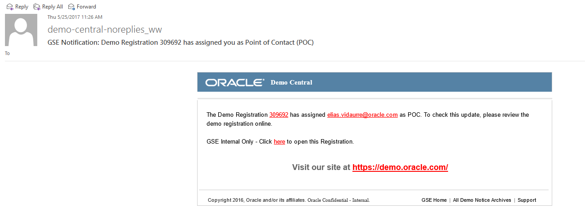  

**Please note:  Your demo instance is NOT automatically provisioned at this point!!**!  You will be notified when your environment is ready – typically 2-4 hours after your demo registration - when you receive an email like the following:
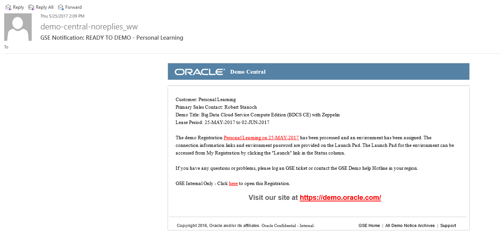  

## Launch the Demo Environment
1)	Visit Demo Central at `http://demo.oracle.com`
2)	Click “Demos” tab
3)	Click “Launch Demo” link next to the registration that id that was provisioned for you.  (Note: your environment name will be unique to your demo registration)
  

4)	Note the usernames and passwords assigned to your environment
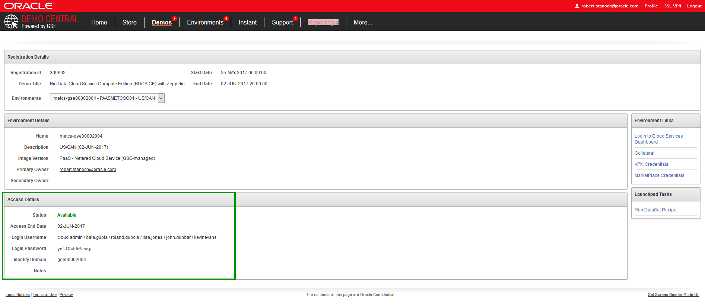  

5)	Click “Login in to Cloud Service Dashboard” link
6)	Login using the following credentials:
-	User: cloud.admin
-	Password: <your cloud.admin user password>

## Customize Your Dashboard to Display Additional Services
The “Big Data – Compute Edition” and “Event Hub – Dedicated Cloud Services” are NOT displayed by default on your Services Dashboard.  Follow these steps to display these services on your dashboard
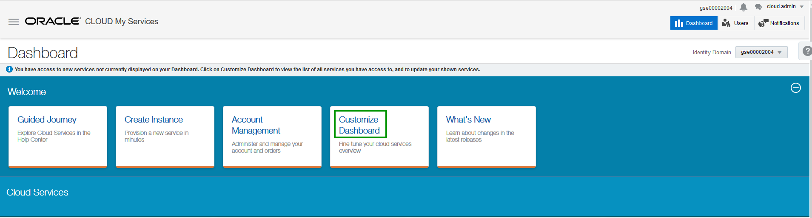  

Scroll down and click “Show” for both “Event Hub – Dedicated” and “Big Data – Compute Edition” Services
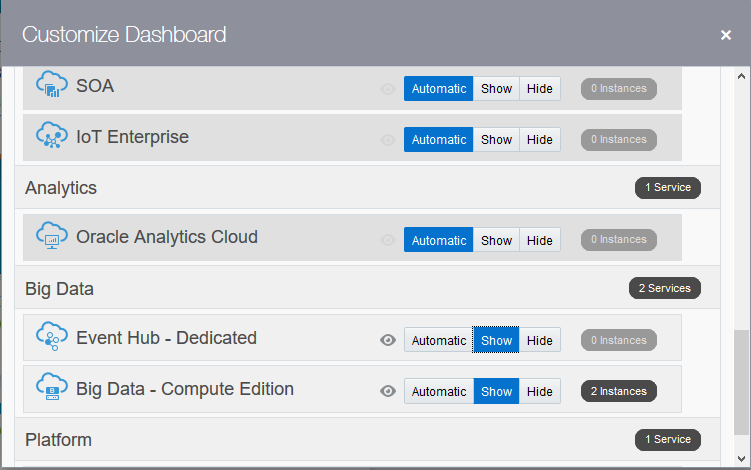 

## Verify the Storage Cloud Service and Storage Container are Created
After logging in, you are directed to the My Services Dashboard.  

Click the “Storage” link to get to the Service Details for Oracle Storage Cloud Service
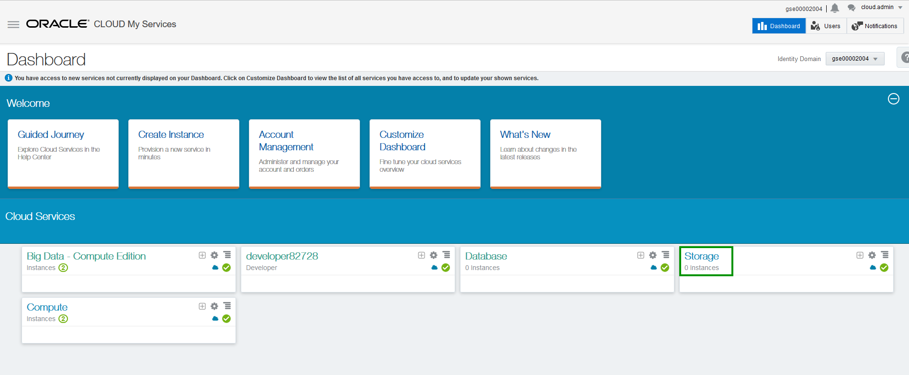 

Note your Identity Domain

Click on the “Open Service Console” button
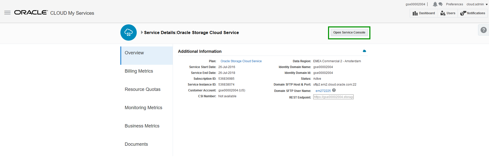 

Note that the “BDCSCE” container has already been created for you. 

Also note in the upper left it says something like “Storage-gse0002004”.  You will use info this when you provision BDCS-CE.
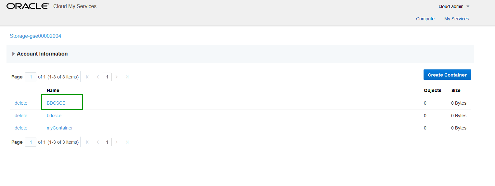

Click “My Services” to go back to your Cloud Services Dashboard

## Verify the Big Data Cloud Service – Compute Edition Service is Created
Click the “Big Data – Compute Edition” link to get to the Service Details for Oracle Big Data Cloud Service – Compute Edition
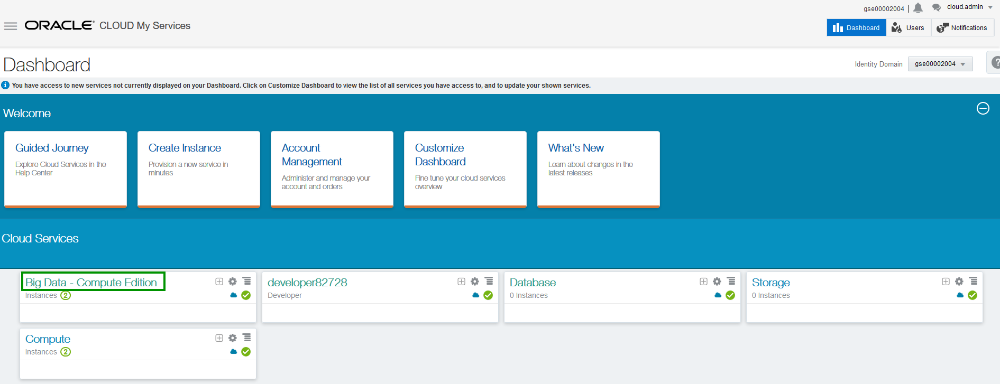

Note your Identity Domain

Click on the “Open Service Console”
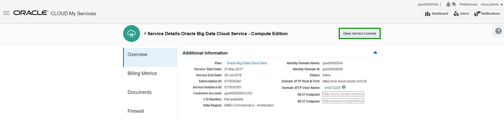

Note that the “myBDCSCE” service has already been created for you
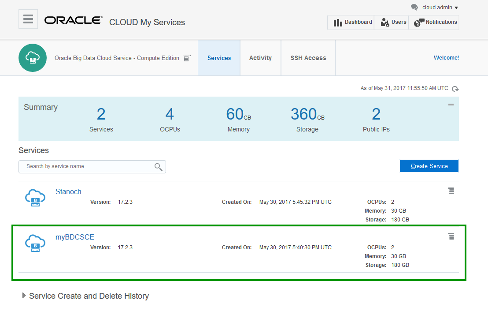

Click on the   icon next the myBDCSCE service, followed by Big Data Cluster Console

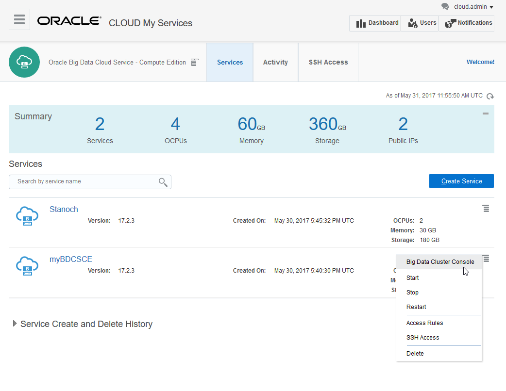

Log in using the following credentials
- User: bdcsce_admin
- Password: Welcome321
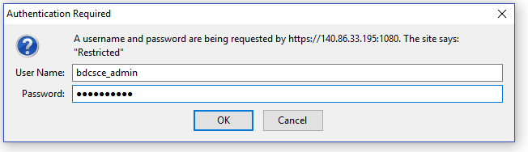

## Begin Your Big Data Journey
Visit `http://www.oracle.com/bigdatajourney` and register with your email address

Click the   button

At this point, you can use the pre-created “myBDCSCE” instance and start with [LabGuide300.md](LabGuide300.md)

OR

You can optionally follow the instructions in [LabGuide200.md](LabGuide200.md) and create a new BDCSCE instance on your own. 
