  

Updated: August 15, 2018 for BDC Version 18.3.2

    
# Lab 100 : Provisioning Oracle Big Data Cloud on Oracle Cloud Infrastructure

## Introduction

In this lab, you learn how to provision a **Oracle Big Data Cloud (BDC)** cluster.  

The Oracle Big Data Cloud (BDC) enables you to rapidly, securely, and cost-effectively leverage the power of an elastic, integrated Big Data Infrastructure to unlock the value in Big Data.   In this lab, we will walk you through the steps to quickly configure and create a Big Data Cloud instance.  When done you will see how to view the configuration and layout of your instance using the Oracle Big Data Console.  

Please direct comments to: David Bayard (david.bayard@oracle.com)

## Objectives

- Get access to the Oracle Public Cloud
- Learn how to upload a file to the Oracle Storage Cloud Object Store
- Learn how to provision a BDC instance
- Learn how to access your BDC instance

# Get access to the Oracle Public Cloud

Your first step is to get access to the Oracle Public Cloud.  There are a couple of ways:

+ You may already have access to an the Oracle Public Cloud environment.  Provided that you have the ability to create new instances of Big Data Cloud Service Compute Edition (BDC) and Oracle Event Hub Cloud Service (OEHCS) as well as the ability to upload files to the Storage Cloud, then you should be able to use your exisitng environment.
+ If you are a customer or prospect, you can sign-up for the free $300 Trial Account.  Please refer to the instructions here: [$300 Trial](xtra300Trial.md)
+ If you are an Oracle employee, you can request a temporary environment from the GSE demo.oracle.com website.  Please refer to the instructions here: [Employee GSE request](xtraGSErequest.md)

In any case, follow one of the above approaches to obtain access to an Oracle Public Cloud account with the ability (and quota) to create new instances.

## A note about Oracle Cloud Infrastructure and Oracle Cloud Infrastructure Classic

Assuming your cloud account allows it, Oracle Big Data Cloud can be deployed to both OCI and OCI-Classic data centers.  

The choice of OCI or OCI-Classic is made when you provision a new BDC instance.  There will be a Region drop-down on the first page of the BDC Create Instance screen.  If you choose an OCI region, then you'll use OCI.  If you choose "No Preference", you'll use OCI-Classic.

These provisioning instructions have been written for OCI.  If you are looking to provision BDC with OCI-Classic, plese use these instructions: [LabGuide100StartHere.md](LabGuide100StartHere.md).

When using BDC with OCI, you'll be using the OCI Object Storage service which is distinct from the OCI-Classic Object Store.  The instructions in this document show you how to use the OCI Console to create a "journeyC" bucket in the OCI Object Store and upload the bootstrap.sh to the "bdcsce/bootstrap/bootstrap.sh" location prior to creating your BDC instance.  You'll also need to complete the pre-requisite steps for running PAAS services in OCI ( https://docs.us-phoenix-1.oraclecloud.com/Content/General/Reference/PaaSprereqs.htm ).

## Know your identity domain

Write down the name of your Identity Domain in a document as you will need it later: 
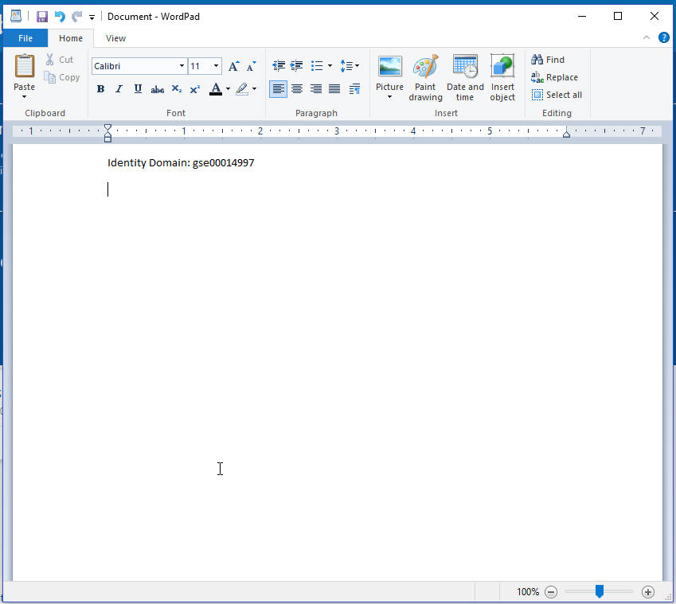 

Hint: You can find the identity domain in the upper right of the MyServices dashboard:
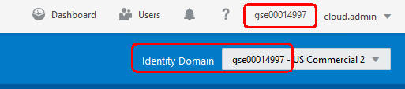 

# Section1: Do the PAAS on OCI pre-requisite steps

Before we can provision a Platform-as-a-Service (PAAS) service such as BDC on OCI, we need to implement the PAAS on OCI pre-requisite steps.

For reference, the basic steps are documented here: https://docs.us-phoenix-1.oraclecloud.com/Content/General/Reference/PaaSprereqs.htm

In particular, there is a good tutorial available here: http://www.oracle.com/webfolder/technetwork/tutorials/obe/cloud/javaservice/JCS/oci-prerequisites/oci-prerequisites.html

## Navigate to the OCI web console

### **STEP 1**: Navigate/login to the Oracle Cloud My Services Dashboard  

  + You should already know the URL to login to Oracle Cloud My Services dashboard and should use that to login directly.  But if you don't, navigate to <a href="https://cloud.oracle.com/home" target="_blank">here</a> . Then click Sign In:
  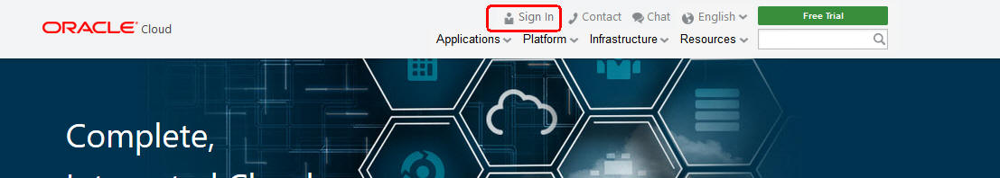 
   

Once you login with your Public Cloud credentials, you will see the Oracle Cloud My Services Dashboard:
 

### **STEP 2**: Using the upper left menu, navigate to the Compute Console  

  + Click on the icon in the upper left of the My Services Dashboard to open up the menu.  Then click on Services to expand the list of Services.  Then click on Compute.
  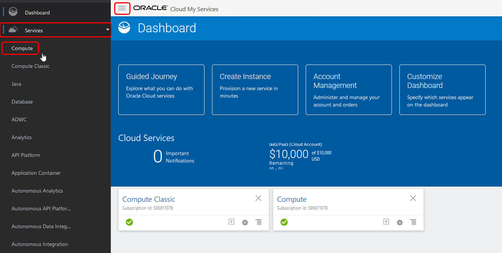 
   

### **STEP 3**: In a different browser window/tab, open up the PAAS on OCI tutorial

  + Click <a href="http://www.oracle.com/webfolder/technetwork/tutorials/obe/cloud/javaservice/JCS/oci-prerequisites/oci-prerequisites.html" target="_blank">here</a> to open up the PAAS on OCI tutorial
    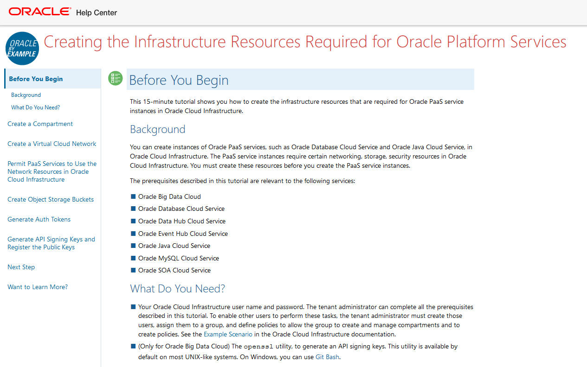 

### **STEP 4**: Follow the PAAS on OCI Tutorial Section 1 to Create a Compartment

  + Note: Oracle Employees using GSE environments may find that there are already existing compartments.  You can use the "Demo" compartment and do not need to create a new one.
    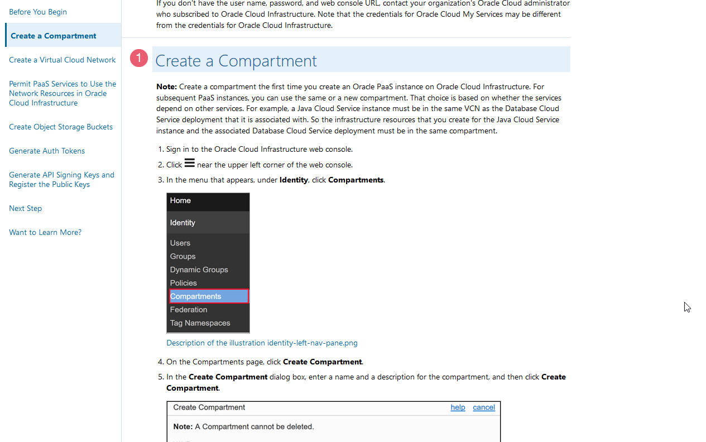 

### **STEP 5**: Follow the PAAS on OCI Tutorial Section 2 to Create a Virtual Cloud Network in the compartment from the last step

   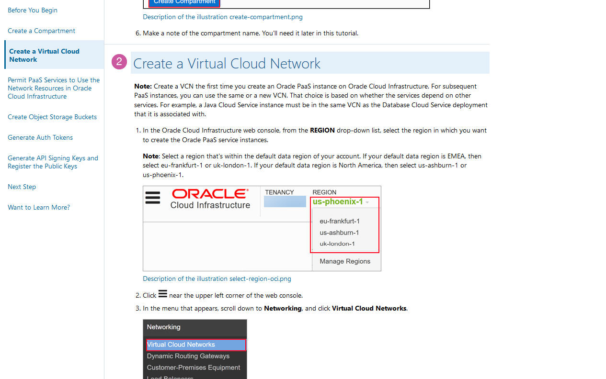 

### **STEP 6**: Follow the PAAS on OCI Tutorial Section 3 to add the appropriate security Policies to OCI

    

### **STEP 7**: Follow the PAAS on OCI Tutorial Section 4 to create Object Storage Bucket

   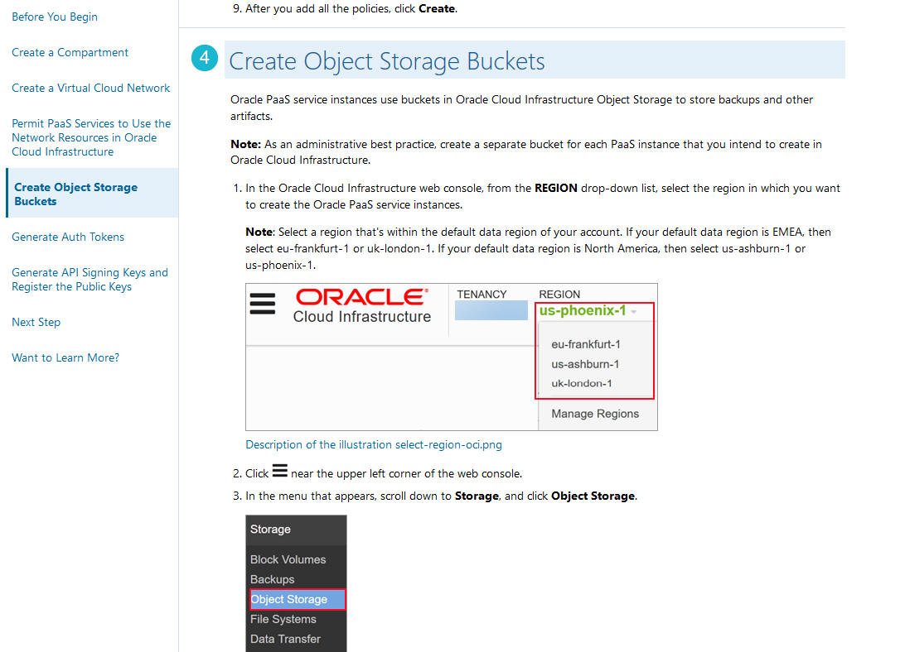 

   + Be sure to write down the name of your Object Storage Bucket as you'll need it later
   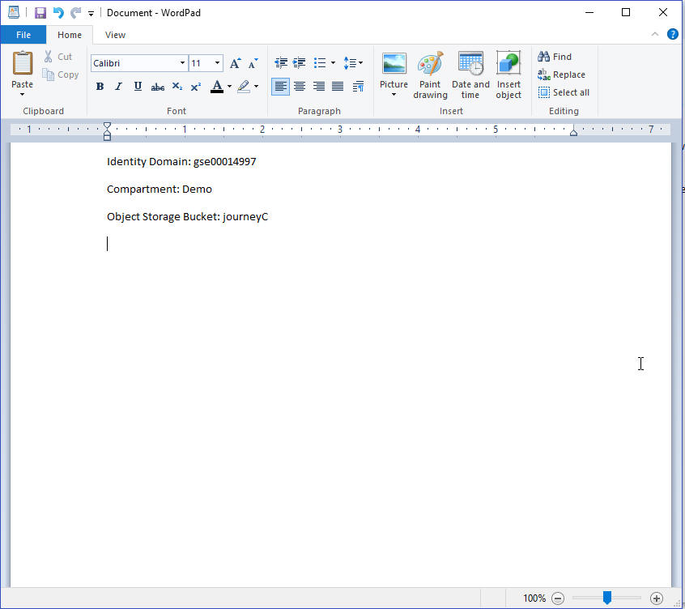 
   

### **STEP 8**: Follow the OCI Documentation to generate API Signing Keys

  + Note: we are not following the PAAS tutorial for this step because the PAAS tutorial currently has instructions that create a signing key using a passphrase.  BDC currently requires a signing key without a passphrase.  So, we will follow the OCI documentation for this step.

   + Click <a href="https://docs.cloud.oracle.com/iaas/Content/API/Concepts/apisigningkey.htm#two" target="_blank">here</a> to open up the OCI documentation for How to Generate an API Signing Key.
    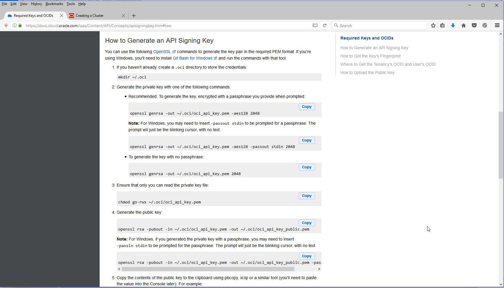 

   + If you are using Windows, you will need to download Git Bash to run these commands.  You can download "Git for Windows" from <a href="https://git-scm.com/download/win" target="_blank">here</a>.
   + Once you have installed Git for Windows, you can launch Git Bash from the Start Menu.  You can find Git Bash under the Git folder.

   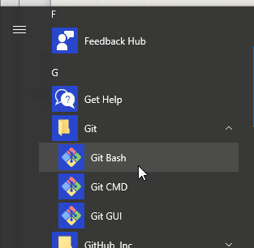 

   + Follow the steps for "How to Generate an API Signing Key"
   + IMPORTANT: In the second step of the OCI instructions, be sure to use the command to generate the key with no passphrase.

   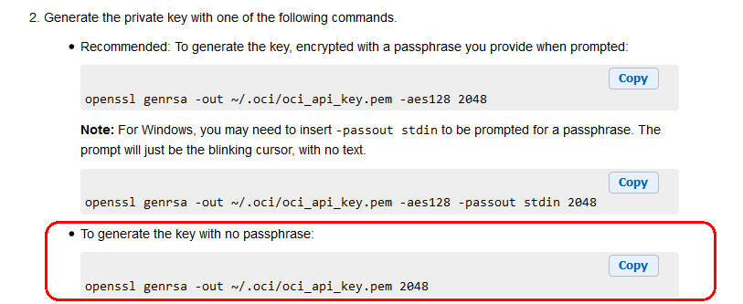 

   + Hint: For the final step, you can leave off the " | pbcopy" part of the command and just copy directly from the text of the Git Bash window.  In other words, instead of running this:

    

run this:

   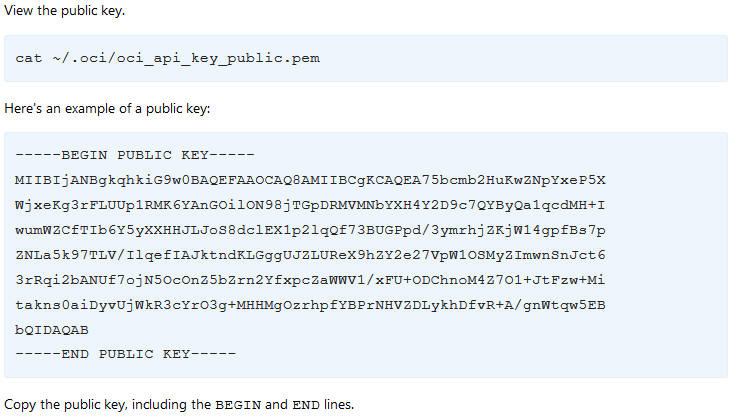 

   + Hint: you can use the "pwd" command to see the working directory where Git Bash is writing its files (so that you can find the .oci folder).

   + Them follow the command for "How to Get the Key's Fingerprint"

   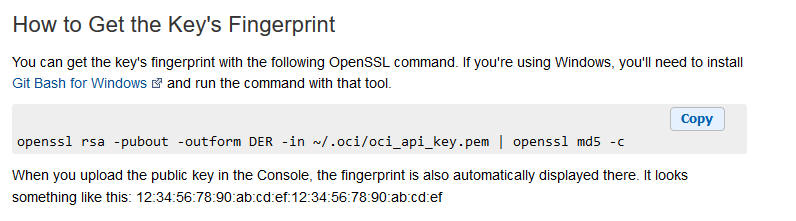 

   + Hint: Keep the Git Bash window open as you will go back and copy some of the existing output later (specifically, you will later copy the output of the "cat ~/.oci/oci_api_key_public.pem" command).

   + Hint: Save the fingerprint (and the public key oci_api_key_public.pem contents, too) in your notepad.

   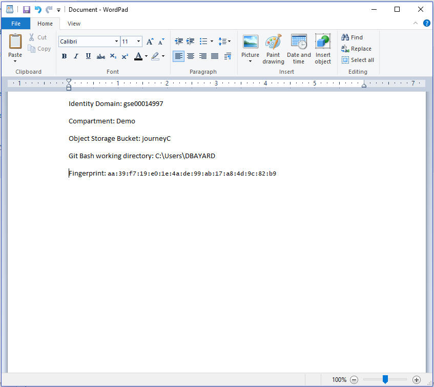 

### **STEP 9**: Create a new native OCI user.

   + Navigate to Identity...Users in the OCI Console.
   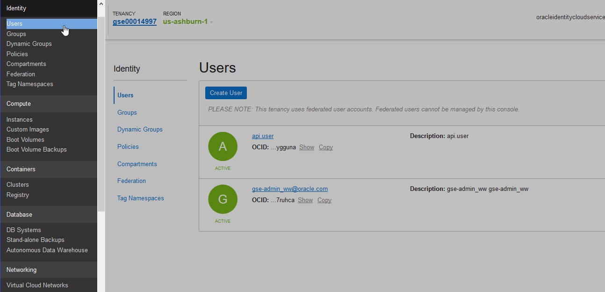 
   + Click Create User.
   + Name the user demo.user and be sure to enter a description too.  Click Create.
   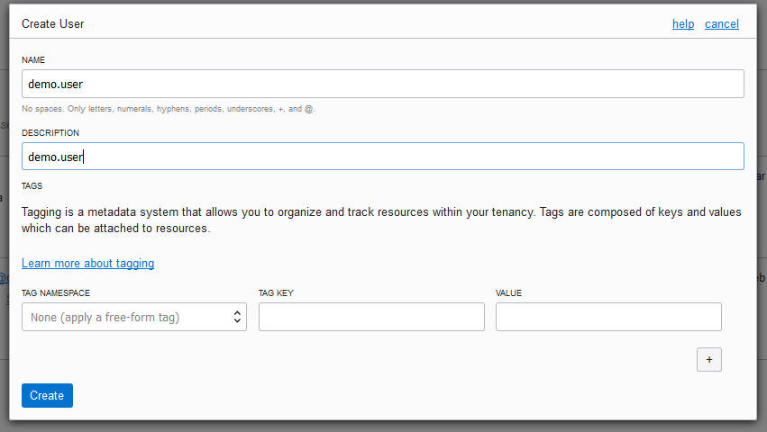 

### **STEP 10**: Copy the new user's OCID.

   + Navigate to your new user.
   + Copy the user's OCID by using the Copy link
   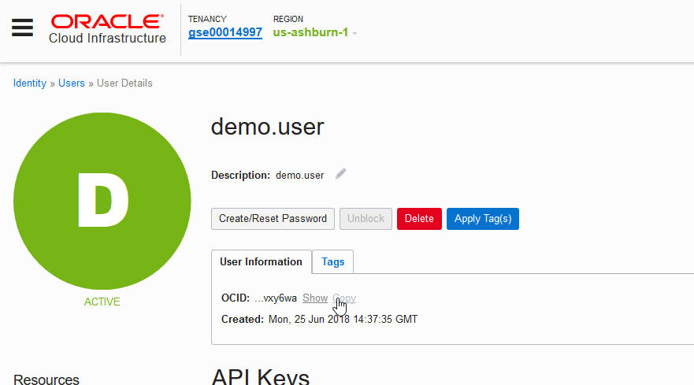 

   + Save the user's OCID for later:
   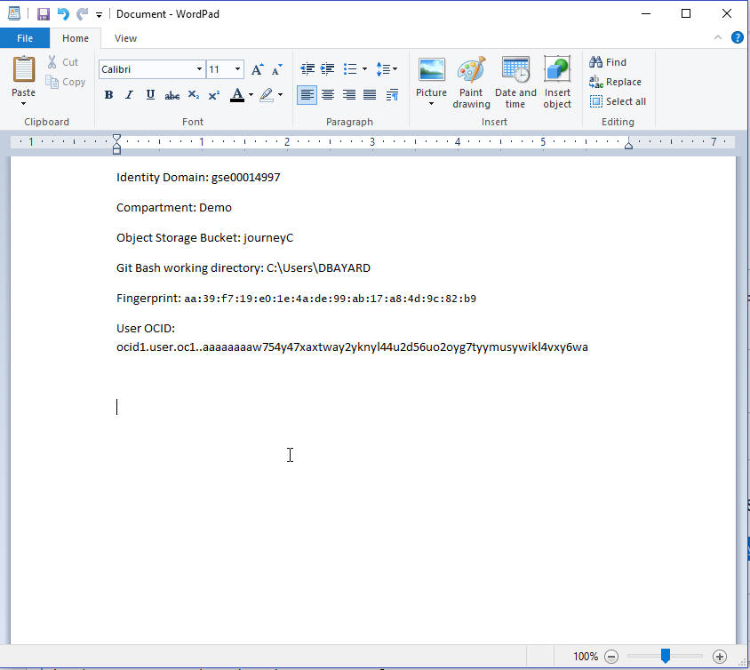   

### **STEP 11**: Add an API Key for the new User.

   + Click on the Add Public Key button:
   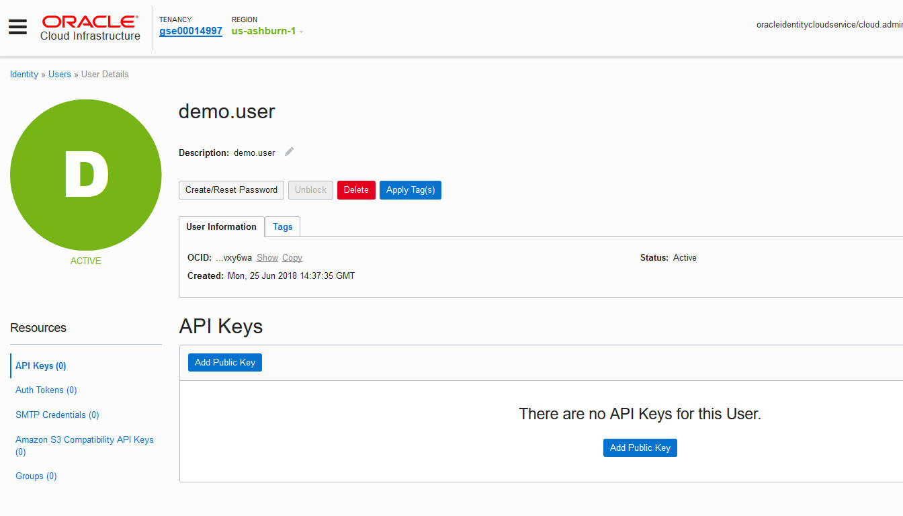 

   + Go back to your Git Bash window and select/copy the public key.
   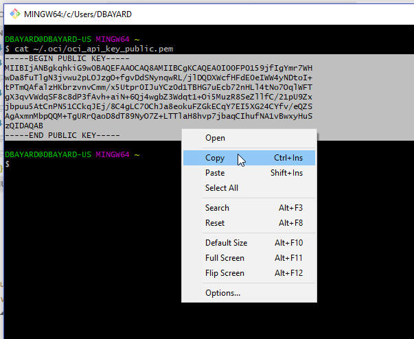   

   + Paste the public key and click Add.
   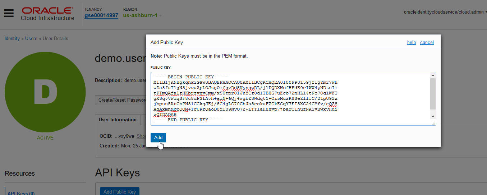   

### **STEP 12**: Add your new user to the Administrator group.

   + Navigate to Identity...Groups
   + Click on Adminstrators group
   + Click Add User to Group
   + Enter demo.user and click Add
   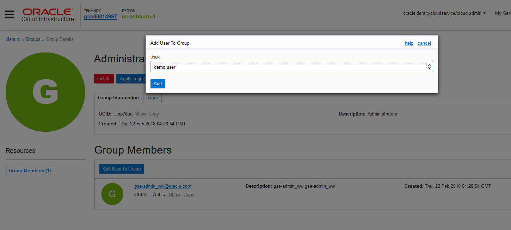 

### **STEP 13**: Download the bootstrap.zip file to your computer, unzip it, and save the bootstrap.sh file in a directory you can easily find.

Download the bootstrap.zip file from here: [https://github.com/millerhoo/journey2-new-data-lake/raw/master/workshops/journey2-new-data-lake/files/100/bootstrap.zip](https://github.com/millerhoo/journey2-new-data-lake/raw/master/workshops/journey2-new-data-lake/files/100/bootstrap.zip)

Be sure to unzip the bootstrap.zip file to extract/save the bootstrap.sh file to a directory on your local computer.

### **STEP 14**: Upload the bootstrap.sh file to your Object Storage bucket.

   + Navigate to Storage...Object Storage
   + Select your compartment (if not already selected)
   + Click on the bucket you created earlier
   + Click Upload Object:
   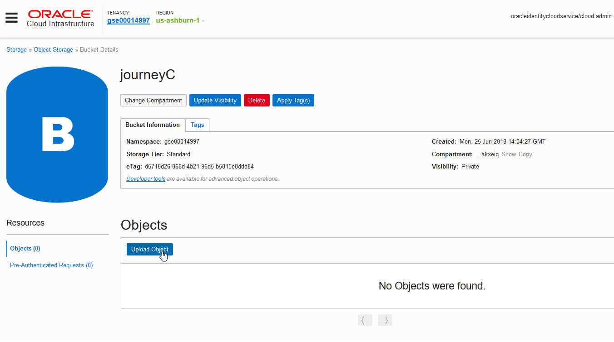 

   + Browse to the bootstrap.sh file (which you extracted from the zip file you downloaded)
   + **Before you click on Upload Object**, change the Object Name to: bdcsce/bootstrap/bootstrap.sh
   + Then click Upload Object:
   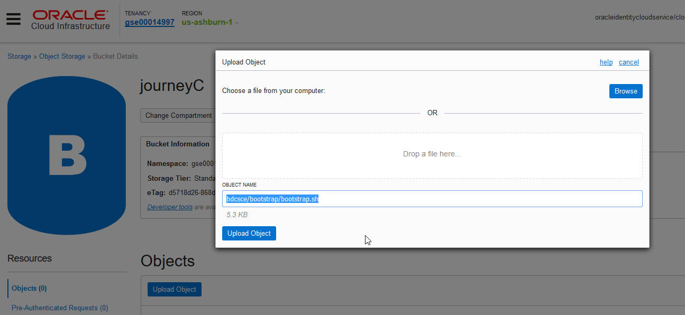    

Here is how it should look after uploading:
  

### **STEP 15**: Review your OCI Service Limits

   + Navigate to Governance...Service Limits in the OCI Console
   + Expand the Compute section in the Service Limits section
   + Either leave this page open or take a screenshot as you will need to what types of VM shapes are available to you in what regions when you deploy BDC.  Focus on the VM.Standard1.4 and VM.Standard2.2 shapes as those are the 2 smallest possible shapes you can use with BDC (either would be fine for the User Journey).

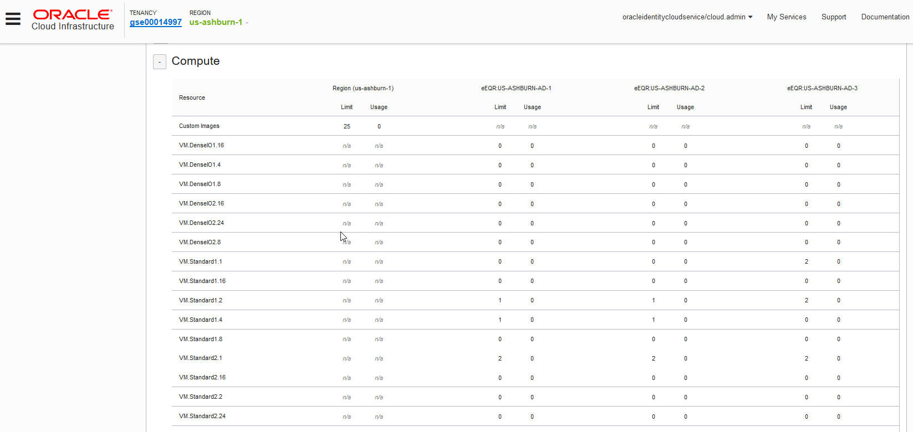  

### **STEP 16**: Click the My Services link in the upper right to return to Cloud My Services Dashboard

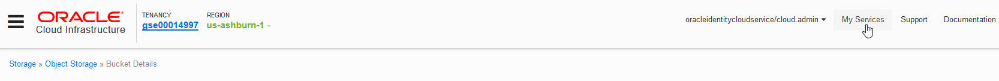  

# Provision a new BDC Instance

## Provision BDC

### **STEP 1**: Navigate/login to the Oracle Cloud My Services Dashboard  

 

### **STEP 2**: Using the upper left menu, navigate to Big Data - Compute Edition

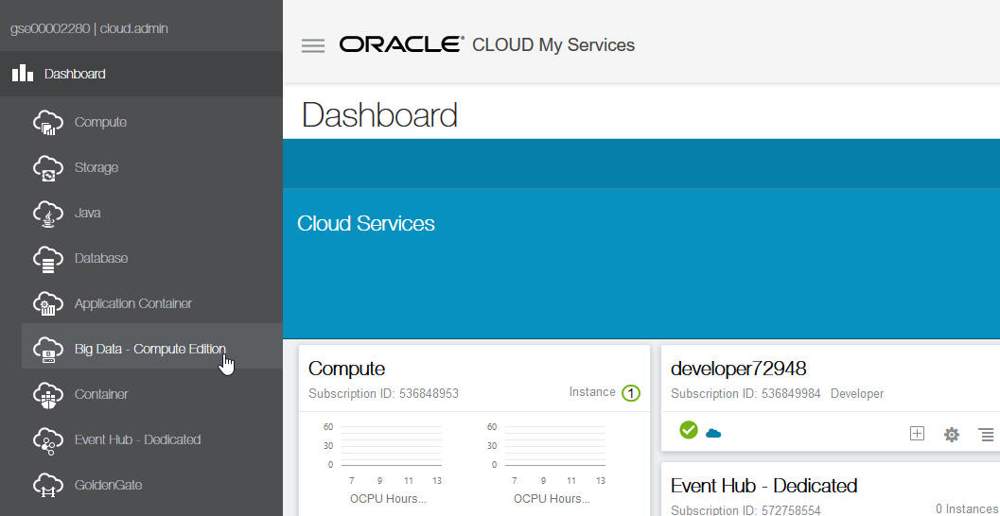 

### **STEP 3**: Click Create Service

If you don't see a Create Service button, then click on the Instances tab/link first.

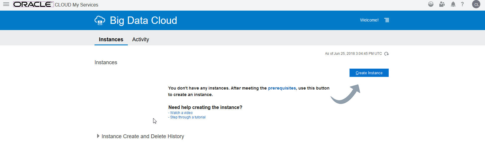  

### **STEP 4**: Fill in the Service Name, Description, Email, Region, and more and click Next
- You can choose whatever you want for Service Name.  It is an identifier to help you in case you create more than one BDC cluster.
- For the Region field, choose your OCI data center region.  You can see your OCI data center region in the upper left of your OCI web console.  Do NOT choose "No Preference" as that will likely put you in an OCI-Classic data center.
- Once you've picked an OCI Region, the UI will show you a list of Availability Domains.  Pick an appropriate one-- you might pick AD-1 because you know you have availability (as shown in the OCI Service Limits) to create 1 or more VM.Standard1.4 instances for your BDC cluster.  The smallest BDC shapes you can use are VM.Standard1.4 or VM.Standard2.2, either of which works for the User Journeys.
- Once you've picked the Availability Domain, you can now pick the VCN Subnet you created for your compartment.
- Click Next when you've filled the fields in.

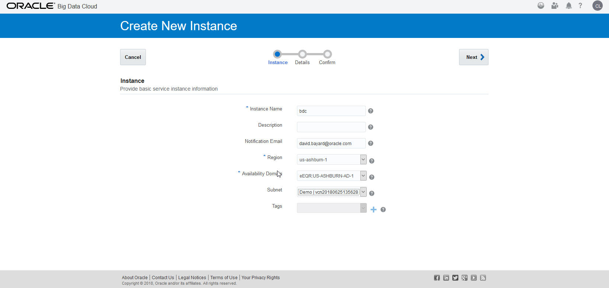  

### **STEP 5**: In the Cluster Configuration section, choose **Full** for the Deployment Profile, enter **1** for the Number of Nodes, and be sure to choose Spark Version 2.1.
- For this workshop, be sure to choose Full for the Deployment Profile.  The Full profile includes components like Hive which are not part of the Basic profile.
- We suggest you choose the Number of Nodes as 1 as that is sufficient to run the journey.  Keeping the number of nodes small will reduce your costs or allow your trial to last longer.
- Currently, the examples are built for Spark 2.1 so be sure to select that version.
- Be sure to also pick a **Compute Shape** for which you have availability as seen in your OCI Service Limits.  For instance, your service limits may have availability for VM.Standard1.4 shapes but not VM.Standard2.2.  So, pick VM.Standard1.4 in that scenario.

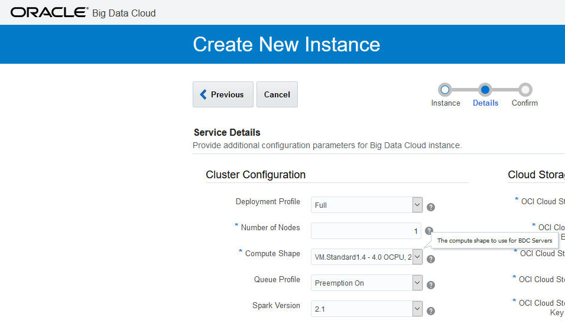  

### **STEP 6**: In the Credentials section, define your SSH public key and the desired username/password to use for the BDC cluster administrator.

- **SSH Public Key**: There are various approaches you can use.  You can define a value for a VM Public Key, use a file with a VM Public Key or create a new key.
  - The easiest choice if new to this environment may be to create a new key.
  - Choose to Create a New Key and hit the Enter button.
  - Once you hit Enter, a File Folder Window will pop up to allow you to control where on your local computer you wish to store your SSH Key file (ex: sshkeybundle.zip).
  - Make sure and write down the location of this SSH key file.
  - The SSH Public Key field will then get filled in automatically.
- **Administrative User**: Define the user id for the administration user for your instance. (We suggest you leave it at its default: bdcsce_admin)
- **Password**: Enter a password to set for the administration user.  \"Password must be at least 8 characters long with at least one lower case letter, one upper case letter, one number and one special character. For example, Ach1z0#d\"
- Confirm Password: Re-enter the password for the administration user.
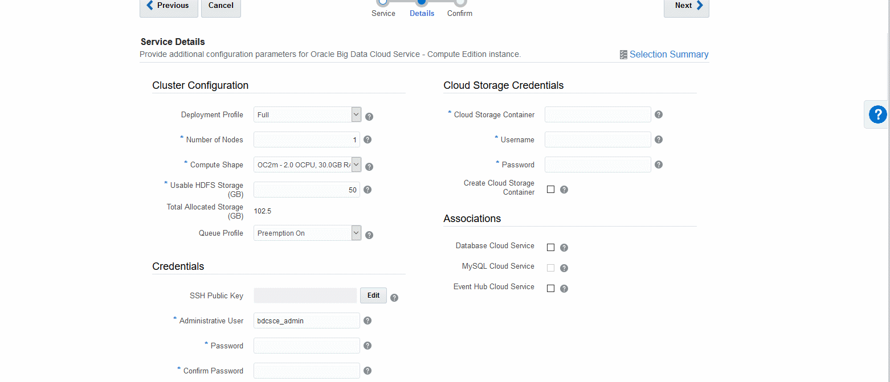  

### **STEP 7**: In the Cloud Storage Credentials section, provide your Cloud Storage information.

- **OCI Cloud Storage URL** – This will be of the form: https://objectstorage.us-ashburn-1.oraclecloud.com where us-ashburn-1 can be replaced with your OCI region name.  You can see the OCI region name in the upper left of your OCI web console:
  

- **OCI Cloud Storage Bucket URL** – This will be of the form: oci://journeyC@gse00014604/ where journeyC can be replaced with the name of the bucket you created and gse00014997 can be replaced with your tenancy name.  You can see the tenancy name in the upper left of your OCI web console.  And you hopefully wrote down the name of your bucket earlier:
 

- **OCI Cloud Storage User OCID** – This will be of the form: ocid1.user.oc1... You wrote down the OCID of the user you created earlier:
 

- **OCI Cloud Storage PEM Key** – This will be the file called "oci_api_key.pem" which is located in the .oci subdirectory under the Git Bash working directory.  Be sure you don't pick the "public" file- you want the file that does NOT have public in the name.
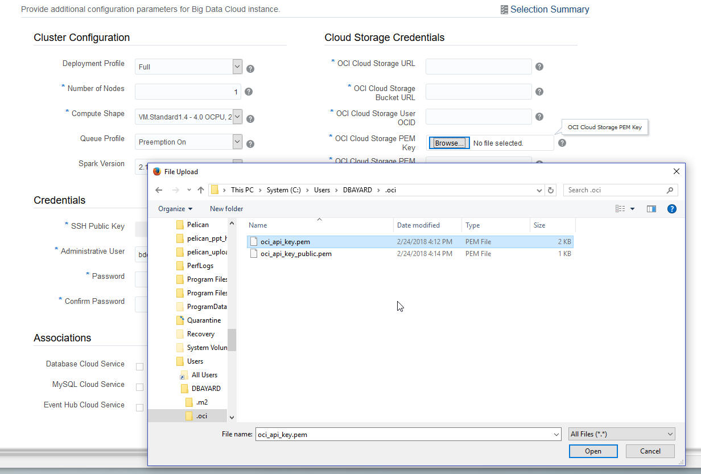 

- **OCI Cloud Storage PEM Key Fingerprint** – This is a string of hexadecimal bytes that you saved earlier.
 

### **STEP 8**: In the Block Storage section, leave the defaults for now.
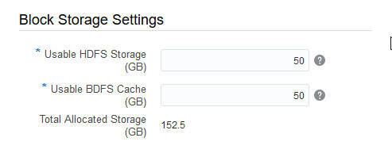  

### **STEP 9**: In the Associations section, leave the checkboxes unchecked for now.

- Associations will automatically create the necessary Access Rules between services.  For this workshop, we'll show you how to manually define Access Rules at a later point.
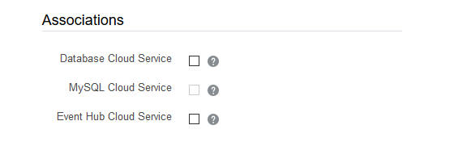  

### **STEP 10**: Click Next.  Then, click Create.

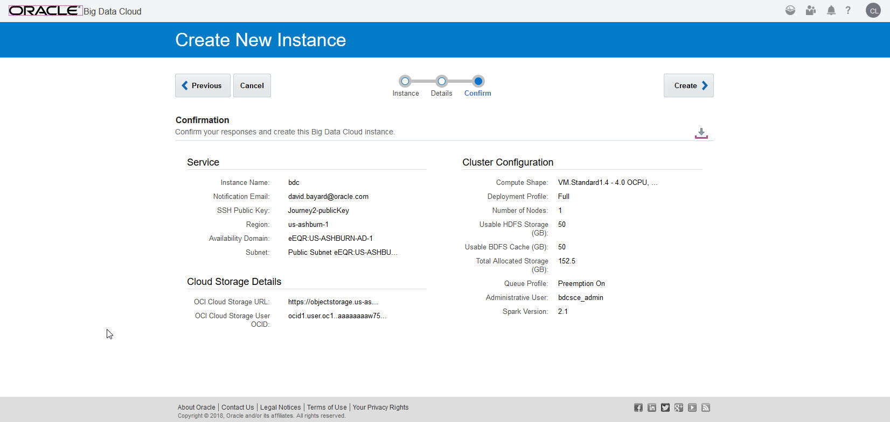  

### **STEP 11**: Wait for the BDC instance to be provisioned.

- While being provisioned, the Status will say "Creating service".  You can click on the status to get more information.
- It can take about 15-20 minutes to finish creating the service.
  

- If you entered a valid email address, you will get an email the instance provisioning is finished:
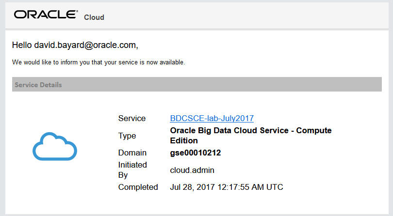  

### **STEP 12**: When the BDC instance is provisioned (the status is Ready), click on the name of the instance to go to the Service Overview page.
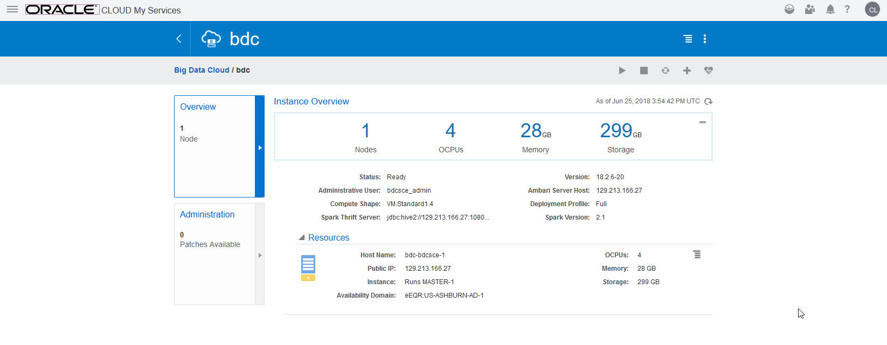  

### **STEP 13**: Review the details on the Service Overview Page
Sections include:
- **Instance Overview** – displays the number of nodes, aggregate OCPU, Memory, and Storage. Also displays summary information of the new Big Data Cloud Service.  This includes the Ambari Server Host whose IP address you can use to access Ambari from a URL in a browser.  As well as highlighting the Administrative user you created as well as the Cloud Storage Container and the Spark Thrift Server (part of the default configuration).  
  - Ambari is a Hadoop management web UI that can accessed through your Ambari Host Server IP address and port 8080 (ex:  http://xxx.xxx.xxx.xxx:8080).  Ambari is not covered in this Lab, but feel free to explore it on your own.
  - Note: to use Ambari, you will need to enable a Network Access rule for port 8080.
  - Your Ambari credentials will be your BDC username and password you defined when you created this instance. 
- **Administration** – displays if there are any patches available.
- **Resources** – displays information on the resources associated with your Service.  As you scale out and add more nodes, the new nodes as well as their Public IP address, OCPUs, Memory and Storage will be displayed.
- **Associations** – displays information on any additional resources associated with your Service.  Associations will automatically setup the necessary network Access Rules between services. 

### **STEP 14**: Record the IP address and host name in your document

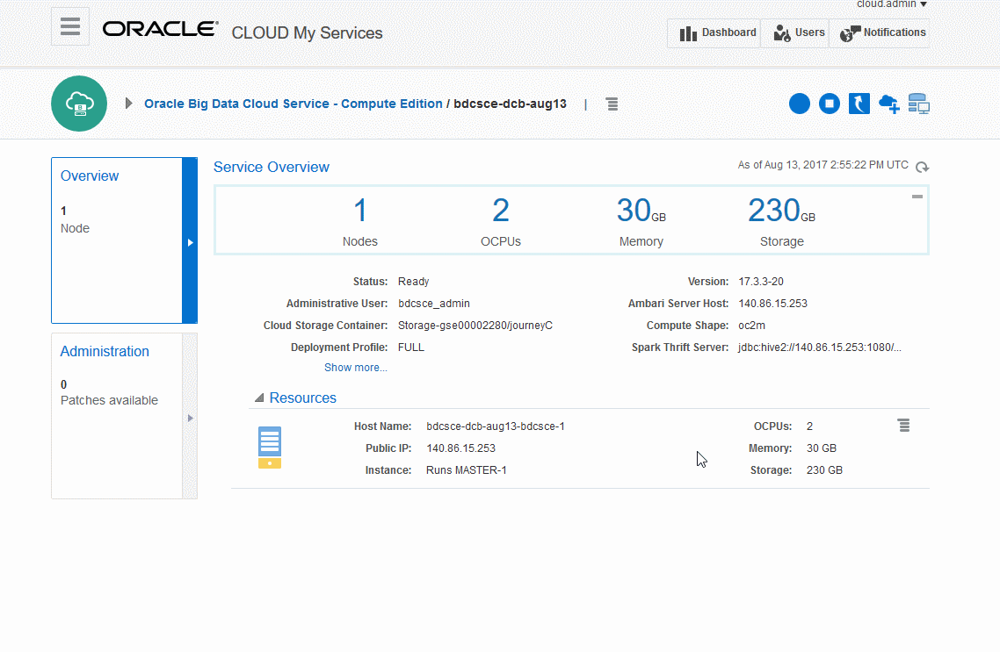 

### **STEP 15**: Access the Big Data Cloud Console
- Launch the Big Data Cloud Console for your BDC cluster.  If this is your first time, you will likely need to allow your browser to accept the self-signed certificate for the web console application.
- You will be asked to provide a username/password.  Use the username and password you defined earlier when you created the BDC instance (the username defaults to bdcsce_admin).  
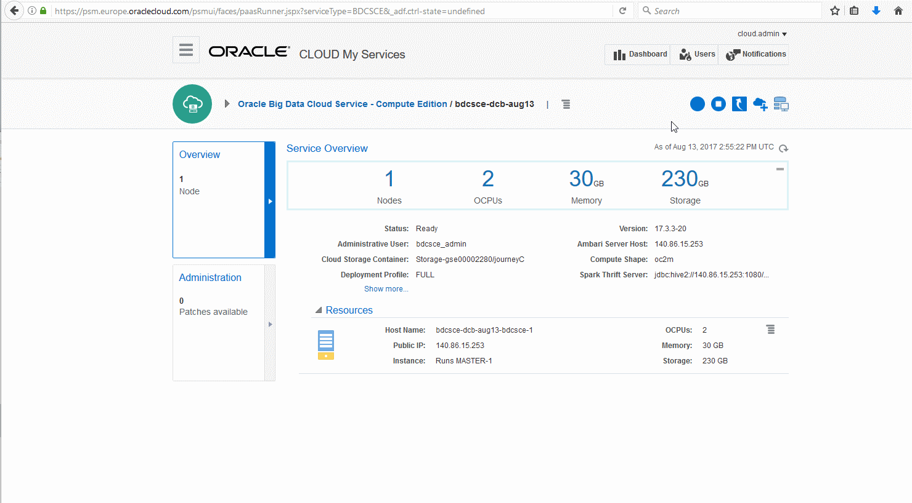 

### **STEP 16**: Record the web URL of the Big Data Cloud Console in your document

# What you Learned

- Learned how to provision a BDC instance
- Learned how to access BDC

## Next Steps

- Proceed to the next Lab to learn how to use BDC's notebook and services like Hive, Spark, and SparkSQL.
