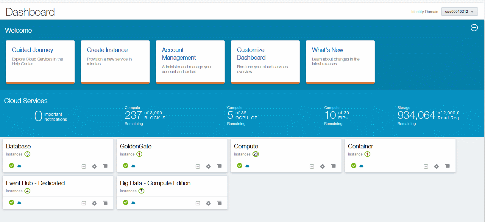
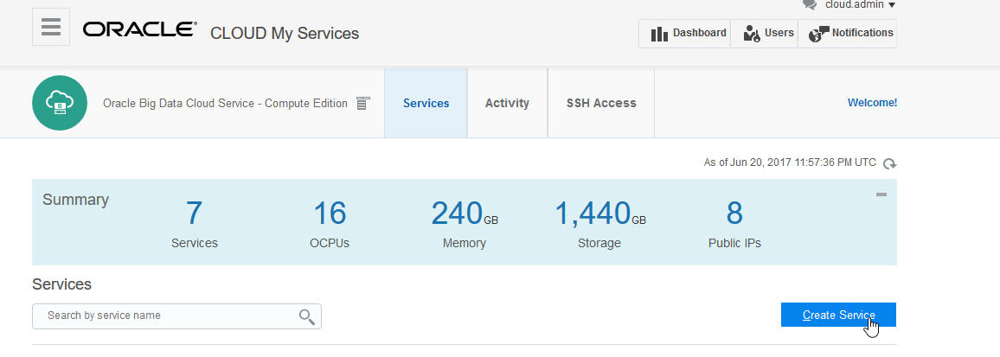
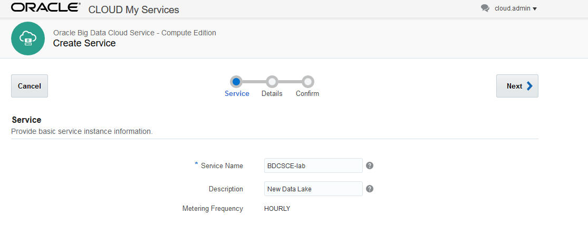
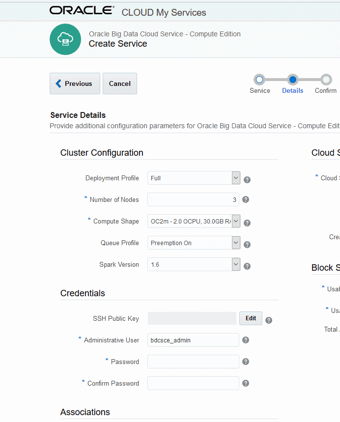
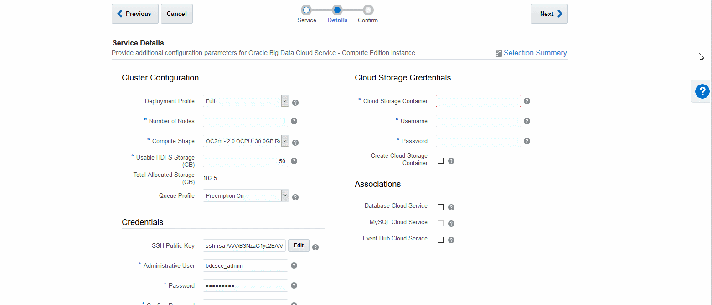
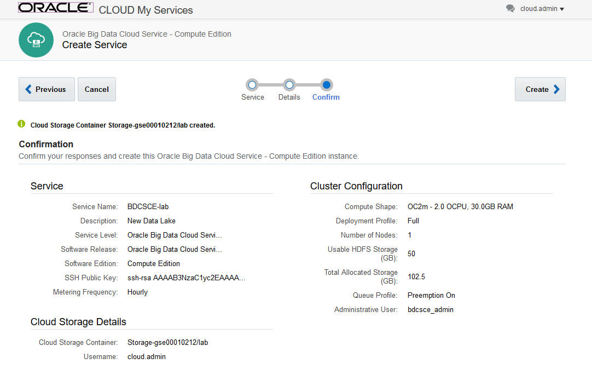
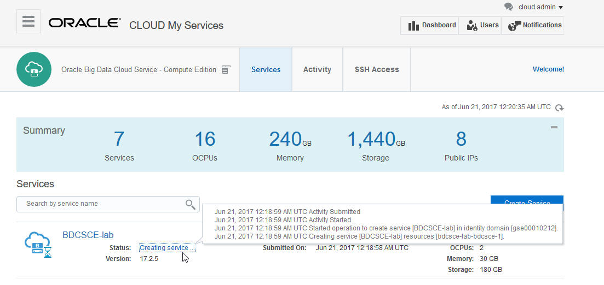
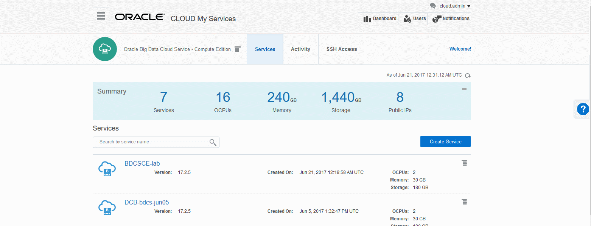

  

Updated: June 20, 2017

## WORK IN PROGRESS

Lab 200 is not yet ready in this format.

For now follow pages 4 to 24 of this document: http://www.oracle.com/partners/en/most-popular-resources/journey2-module2-3702610.pdf

Note: if you are an Oracle employee following the Lab100GSE instructions to use a GSE Deal Server, you can skip this lab and move to lab 300.

## Introduction

In this lab, you learn how to provision a **Oracle Big Data Cloud Service - Compute Edition (BDCS-CE)** cluster.  

The Oracle Big Data Cloud Service - Compute Edition (BDCS-CE) enables you to rapidly, securely, and cost-effectively leverage the power of an elastic, integrated Big Data Infrastructure to unlock the value in Big Data.   In this lab, we will walk you through the steps to quickly configure and create a Big Data Cloud Service instance.  When done you will see how to view the configuration and layout of your instance using the Oracle Big Data Console, the Ambari management interface and how to access your instance using SSH to your servers using a command line terminal.  The tutorial will also show how to add additional nodes to a Hadoop cluster, monitor jobs, set access rules, modify configuration settings and view activity on the Hadoop cluster.  

Please direct comments to: David Bayard (david.bayard@oracle.com)

## Objectives

- Learn how to provision a BDCS-CE instance
- Learn how to access BDCS-CE

## Required Artifacts

- Access to an Oracle Public Cloud identity domain (by following Lab100 or Lab100GSE)
- A provisioned Storage Cloud instance (included the Replication Policy setup, as described in Lab100 or Lab100GSE)

# Provision a new BDCS-CE Instance

## Provision BDCS-CE

### **STEP 1**: Navigate/login to the Oracle Cloud My Services Dashboard  

-  

### **STEP 2**: Click the Create Instance link (in the Create Instance box under the Welcome layer)

### **STEP 3**: Click All Services, then click Create next to Big Data - Compute Edition

-   

### **STEP 3**: Click Create Service on the BDCS-CE services page

-   

### **STEP 4**: Fill in the Service Name and Description and click Next

-   

### **STEP 5**: In the Cluster Configuration section, choose **Full** for the Deployment Profile and choose **1** for the Number of Nodes.

-   

### **STEP 6**: In the Credentials section, define your SSH public key and the desired username/password to use for the BDCS-CE cluster administrator.

- SSH Public Key: Define a value for a VM Public Key, use a file with a VM Public Key or create a new key. The easiest choice if new to this environment may be to create a new key. Choose to Create a New Key and hit the Enter button.   Once you hit Enter, a File Folder Window will pop up to allow you to control where on your local computer you wish to store your SSH Key file (ex: sshkeybundle.zip).  Make sure and write down the location of this SSH key file.   The SSH Public Key field will then get filled in automatically.
= Administrative User: Define the user id for the administration user for your instance. (We suggest you leave it at its default: bdcsce_admin)
- Password: Enter a password to set for the administration user.
- Confirm Password: Verify the password for the administration user.
-   

### **STEP 7**: In the Cloud Storage Credentials section, XXXXXXXXXX.

-   

### **STEP 8**: In the Associations section, leave the checkboxes unchecked for now.

- Associations will automatically create the necessary Access Rules between services.  For this workshop, we'll show you how to manually define Access Rules at a later point.

### **STEP 9**: Click Next.

### **STEP 10**: Click Create.

-   

### **STEP 11**: Wait for the BDCS-CE instance to be provisioned.

- While being provisioned, the Status will say "Creating service".  You can click on the status to get more information.
- As of 17.2.5, it can take about 15-20 minutes.
-   

### **STEP 12**: When the BDCS-CE instance is provisioned, click on the name of the instance to go to the Service Overview page.

-   

## XXXXXXXX  Page 17

# What you Learned

- Learned how to import notes into the BDCS-CE Notebook
- Learned how to work with the BDCS-CE Notebook
- Learned how to work with Hive
- Learned how to work with Spark and Spark SQL
- Learned how to work with Oracle Cloud Storage Object Store

# Next Steps

- Run some of the demonstration notes in the Notebook
- Experiment with your own data.  Load it into the Object Store, define Spark or Hive tables against it, and run queries against your data.
- Proceed to the next Lab to learn how to add Oracle Event Hub Cloud Service to the architcture and how to leverage Spark Streaming