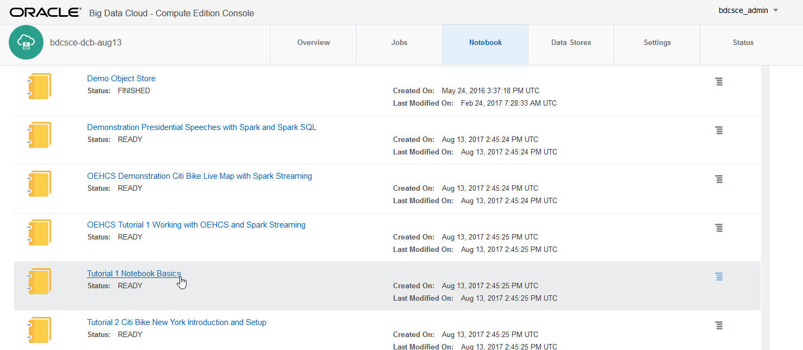

  
Updated: August 16, 2017 for BDCSCE Version 17.3.3-20

## Introduction

This lab will walk you through getting to know **Oracle Big Data Cloud Service - Compute Edition (BDCS-CE)**.  

You will use the Notebook feature of BDCS-CE to run a series of tutorials that show you different aspects of functionality.  In this lab, you will learn how to work with the **Zeppelin Notebook**.  You will also be introduced to the New York City Citi Bike dataset that we will use for experimentation.  You will see how we can download some sample data and upload it to the **Oracle Cloud Storage Object Store**.  And finally, another tutorial will show you how to interact with **Hive**.   

Notebooks are used to explore and visualize data in an iterative and easily documented fashion. Oracle Big Data Cloud Service - Compute Edition uses Apache Zeppelin as its notebook interface and coding environment.  Information about Zeppelin can be found here: [https://zeppelin.apache.org/](https://zeppelin.apache.org/) .  To see examples of notes created and shared by other Zeppelin users, see [https://www.zeppelinhub.com/viewer](https://www.zeppelinhub.com/viewer) .

Please direct comments to: David Bayard (david.bayard@oracle.com)

## Objectives

- Learn how to import notes into the BDCS-CE Notebook
- Learn how to work with the BDCS-CE Notebook
- Learn about the Citi Bike dataset and upload it to Oracle CLoud Storage Object Store
- Learn how to work with Hive

## Required Artifacts

- A running BDCS-CE instance and Storage Cloud Object Store instance, created as per the instructions in lab 100.  These instructions included the use of a special "bootstrap.sh" script which setup the BDCS-CE environment for this workshop.

## Connect to the BDCS-CE Console

### **STEP 1**: Navigate/login to the Oracle Cloud My Services Dashboard  

-  

### **STEP 2**: Navigate to the My Services page for your BDCS-CE cluster

-   

### **STEP 3**: Launch the Big Data Cluster Console

- Launch the Big Data Cluster Console for your BDCS-CE cluster.  If this is your first time, you will likely need to allow your browser to accept the self-signed certificate for the web console application.
- You will be asked to provide a username/password.  Use the username and password you defined earlier when you created the BDCS-CE instance (the username defaults to bdcsce_admin).  If you are an Oracle Employee/Partner using a GSE "deal server" pre-provisioned environment, the un/pw will be set to bdcsce_admin/Welcome321
  

# Learn the basics of the BDCS-CE Notebook

## Open and run the first Tutorial note in the notebook

### **STEP 1**: Click on the Notebook tab.

 

### **STEP 2**: Scroll down to the Tutorial 1 Notebook Basics and click on the title.

**You should see approximately 20 notes listed.  If you do not, then the bootstrap.sh script did not work correctly.**

**Due to a <a href="http://docs.oracle.com/en/cloud/paas/big-data-compute-cloud/csbdk/index.html#CSBDK-GUID-B6DA8EA4-7025-46C1-804C-42A067D1EA9C" target="_blank">known issue</a> with BDCS 17.3, users in the "US Commercial 2" data center will face an issue where bootstrap.sh did not run.**

**In any case, if you do not see the tutorial notes (i.e. bootstrap.sh did not run correctly), please refer to the [xtra Running bootstrap.sh](xtraRunBootstrap.md) lab.  Follow the instructions in that lab, then return here.**

 

### **STEP 3**: Read and follow the instructions in Tutorial 1

- The paragraphs of the note are displayed. 

Please walk through the paragraphs one by one. Read through the content of the paragraphs as you get to them. There is much useful information in the paragraphs that is not reproduced into these instructions.
 

# Learn about the Citi Bike Dataset and upload it to Object Store

## Open and run the second Tutorial note in the notebook

### **STEP 1**: Click on the Notebook tab.  Then click on Tutorial 2 to open it. 

 

### **STEP 2**: Read and follow the instructions in Tutorial 2

- The paragraphs of the note are displayed. 

Please walk through the paragraphs one by one. Read through the content of the paragraphs as you get to them. There is much useful information in the paragraphs that is not reproduced into these instructions.

# Learn how to work with Hive

## Open and run the third Tutorial note in the notebook

### **STEP 1**: Click on the Notebook tab.  Then click on Tutorial 3 to open it. 

 

### **STEP 2**: Read and follow the instructions in Tutorial 3

- The paragraphs of the note are displayed. 

# What you Learned

- Learned how to work with the BDCS-CE Notebook
- Learned about the Citi Bike dataset and how to upload it to the Oracle Cloud Storage Object Store
- Learned how to work with Hive

# Next Steps

- Proceed to the next Lab to learn about Spark and Spark SQL
