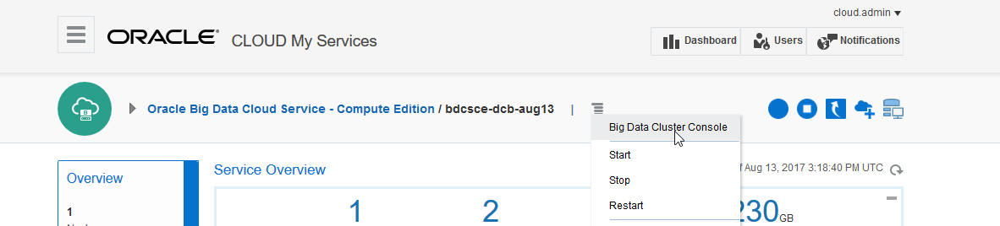
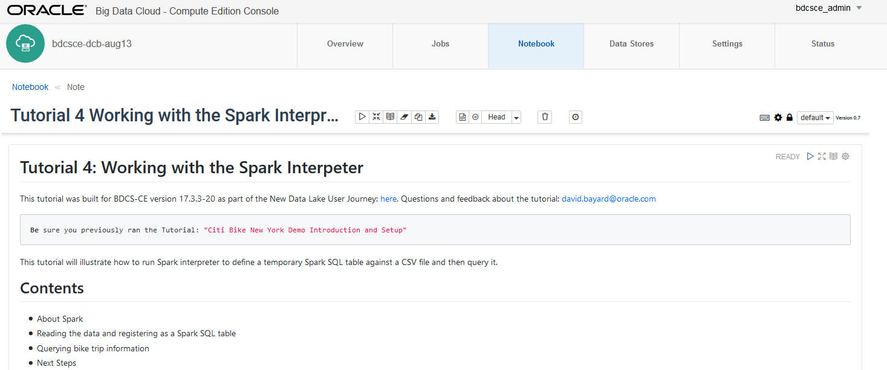
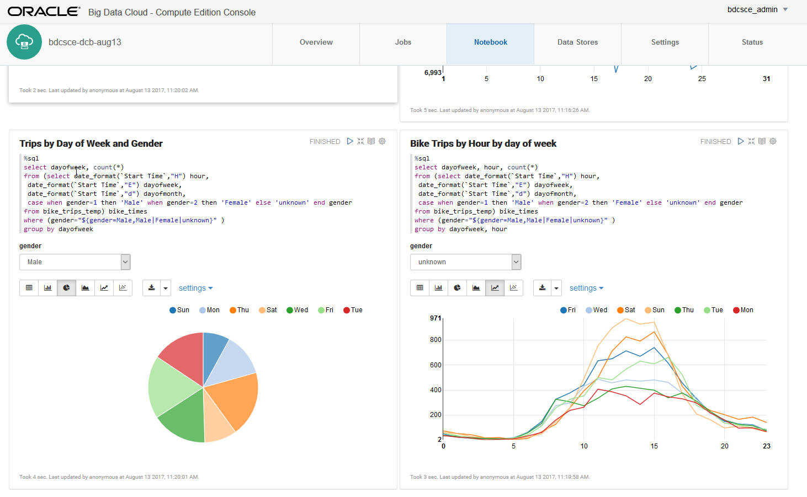
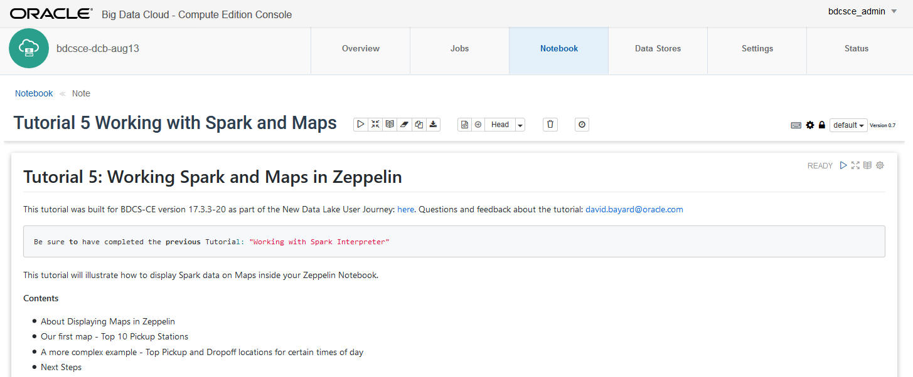
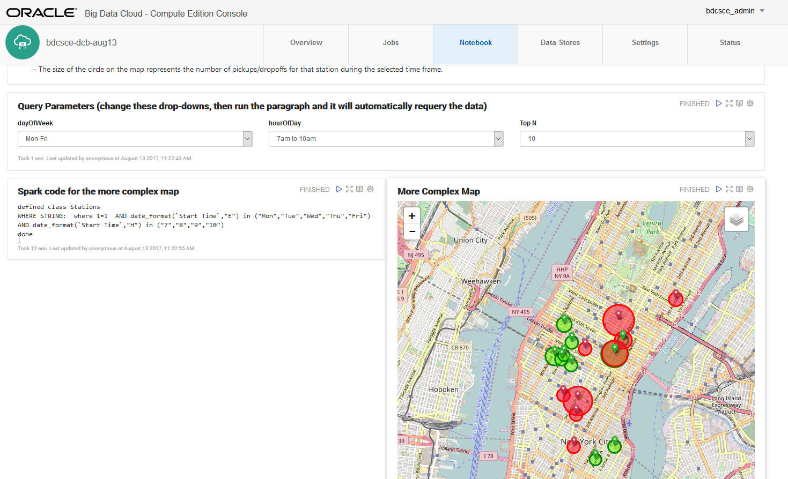
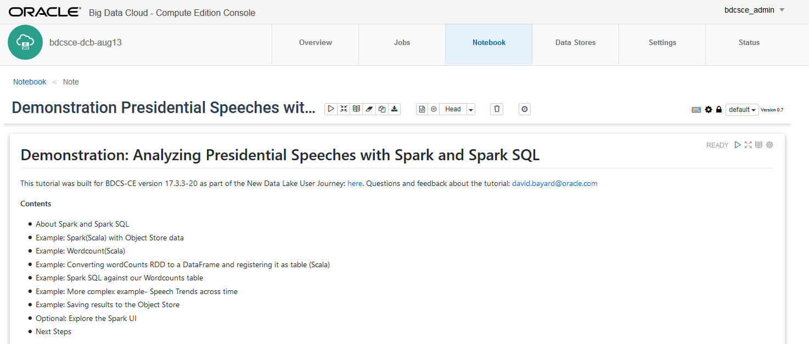
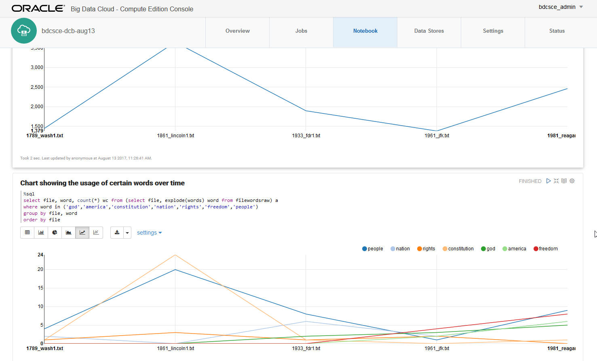

  
Updated: August 13, 2017 for BDCSCE Version 17.3.1-20

## Introduction

This lab will walk you through additional features of **Oracle Big Data Cloud Service - Compute Edition (BDCS-CE)**.  

In particular, this lab will focus on interacting with **Spark** and **Spark SQL**. 

Please direct comments to: David Bayard (david.bayard@oracle.com)

## Objectives

- Learn how to work with Spark and Spark SQL
- Learn how to work with Maps with Spark and Zeppelin

## Required Artifacts

- A running BDCS-CE instance and Storage Cloud Object Store instance, created as per the instructions in Lab 100.  These instructions included the use of a special "bootstrap.sh" script which setup the BDCS-CE environment for this workshop.
- You completed the tutorials in Lab 200 Getting to know BDCS-CE

## Connect to the BDCS-CE Console

### **STEP 1**: Navigate/login to the Oracle Cloud My Services Dashboard  

 

### **STEP 2**: Navigate to the My Services page for your BDCS-CE cluster

  

### **STEP 3**: Launch the Big Data Cluster Console

  

# Learn how to work with Spark and Spark SQL

## Open and run the Tutorial 4 note in the notebook

### **STEP 1**: Click on the Notebook tab.  Then click on the Working with the Spark Interpreter tutorial to open it. 

 

### **STEP 2**: Read and follow the instructions in the Tutorial

# Learn how to work with Maps with Spark and Zeppelin

## Open and run the Tutorial 5 note in the notebook

### **STEP 1**: Click on the Notebook tab.  Then click on the Working with Spark and Maps tutorial to open it. 

 

### **STEP 2**: Read and follow the instructions in the Tutorial

# Check out a bonus demonstration using Spark with Presidential Speeches

## Open and run the Demonstration Presidential Speeches note in the notebook

### **STEP 1**: Click on the Notebook tab.  Then click on the Demonstration Presidential Speeches with Spark and Spark SQL note to open it. 

 

### **STEP 2**: Read and follow the instructions in the note

# What you Learned

- Learned how to work with Spark and Spark SQL
- Learned how to work with Maps and Spark and Zeppelin

# Next Steps

- Experiment with your own data.  Load it into the Object Store, define Spark or Hive tables against it, and run queries against your data.
- Proceed to the next Lab to learn how to add Oracle Event Hub Cloud Service to the architcture and how to leverage Spark Streaming