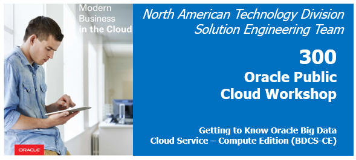
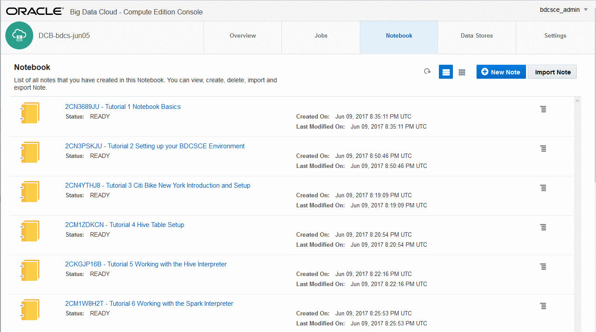
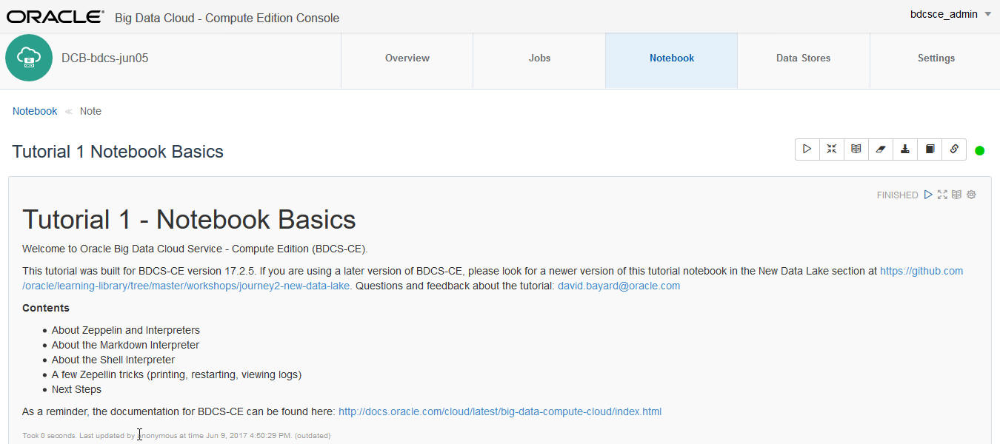
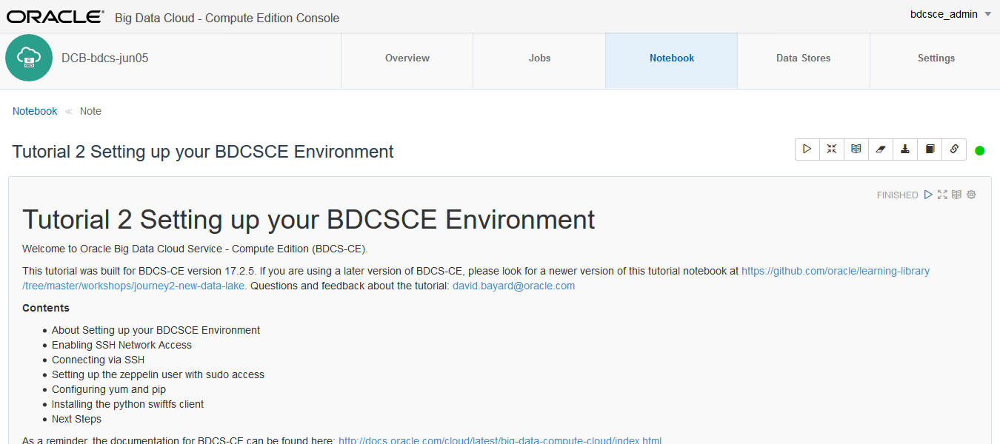
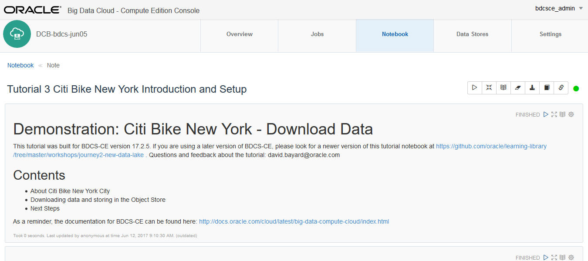
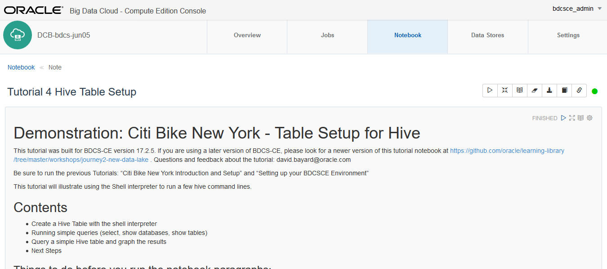
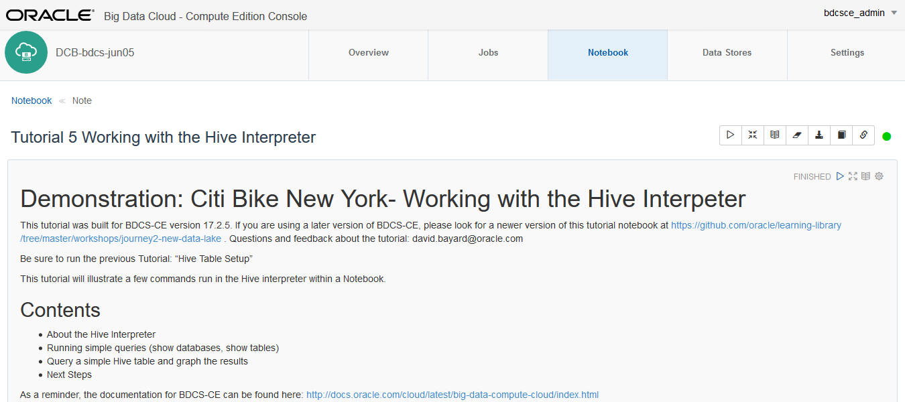
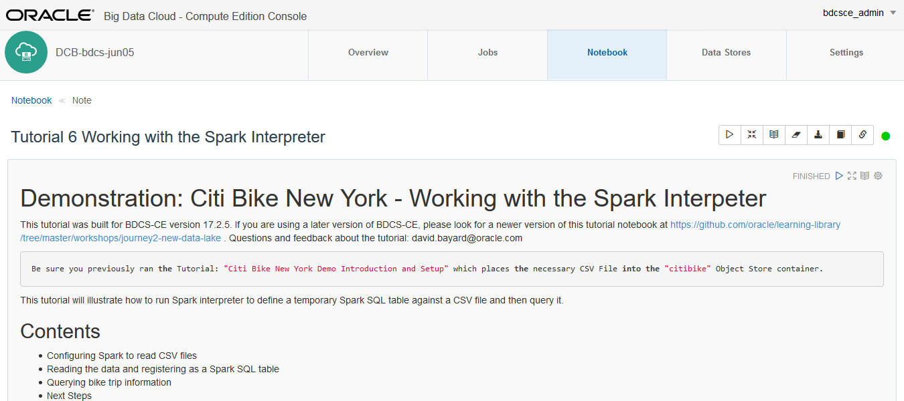
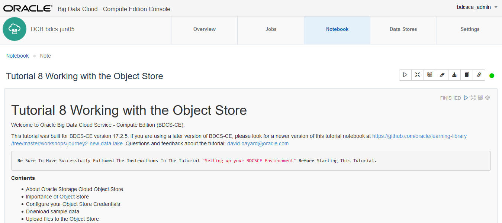

  
Updated: June 16, 2017

## Introduction

This lab will walk you through getting to know **Oracle Big Data Cloud Service - Compute Edition (BDCS-CE)**.  

You will use the Notebook feature of BDCS-CE to run a series of tutorials that show you different aspects of functionality.  You will learn how to work with the **Zeppelin Notebook**.  Another tutorial will show you to interact with **Hive**.   Then you will learn how to interact with **Spark** and **Spark SQL**. And a final tutorial will show you how to use **Oracle Cloud Storage Object Store**.  

Notebooks are used to explore and visualize data in an iterative and easily documented fashion. Oracle Big Data Cloud Service - Compute Edition uses Apache Zeppelin as its notebook interface and coding environment.  Information about Zeppelin can be found here: [https://zeppelin.apache.org/](https://zeppelin.apache.org/) .  To see examples of notes created and shared by other Zeppelin users, see [https://www.zeppelinhub.com/viewer](https://www.zeppelinhub.com/viewer) .

Please direct comments to: David Bayard (david.bayard@oracle.com)

## Objectives

- Learn how to import notes into the BDCS-CE Notebook
- Learn how to work with the BDCS-CE Notebook
- Learn how to work with Hive
- Learn how to work with Spark and Spark SQL
- Learn how to work with Oracle Cloud Storage Object Store

## Required Artifacts

- A running BDCS-CE instance and Storage Cloud Object Store instance (you created these in the previous lab)
- Zip file of lab tutorials for the BDCS-CE Notebook, which can be downloaded from here: [Lab300Tutorials.zip](files/Lab300Tutorials.zip)

# Import the tutorial notes into the BDCS-CE Notebook

## Download the Tutorials zip file for this lab

### **STEP 1**: Download the Tutorials zip file 

- Download the Tutorials zip file from here: [Lab300Tutorials.zip](files/Lab300Tutorials.zip)

### **STEP 2**: Unzip the Tutorials zip file

- Unzip the tutorials file on your workstation.  There should be a number of files with .json extensions.

## Connect to the BDCS-CE Console

### **STEP 1**: Navigate/login to the Oracle Cloud My Services Dashboard  

-  

### **STEP 2**: Navigate to the My Services page for your BDCS-CE cluster

-   

### **STEP 3**: Launch the Big Data Cluster Console

- Launch the Big Data Cluster Console for your BDCS-CE cluster.  If this is your first time, you will likely need to allow your browser to accept the self-signed certificate for the web console application.
- You will be asked to provide a username/password.  Use the username and password you defined earlier when you created the BDCS-CE instance (the username defaults to bdcsce_admin).  If you are an Oracle Employee/Partner using a GSE "deal server" pre-provisioned environment, the un/pw will be set to bdcsce_admin/Welcome321
  

## Import the Tutorial Notes into the BDCS-CE Notebook

### **STEP 1**: Navigate to the Notebook tab  

### **STEP 2**: Click Import Note.  Browse your workstation to import the first tutorial .json file.

- The .json files were downloaded and unzipped earlier in this lab.

### **STEP 3**: Repeat the above for the other Tutorial .json files in the zip

- In addition, there are some demonstration notes you can import as well.

# Learn the basics of the BDCS-CE Notebook

## Open and run the first Tutorial note in the notebook

### **STEP 1**: Click on the Notebook tab.  Then click on Tutorial 1 to open it. 

-  

### **STEP 2**: Read and follow the instructions in Tutorial 1

- The paragraphs of the note are displayed. 

Please walk through the paragraphs one by one. Read through the content of the paragraphs as you get to them. There is much useful information in the paragraphs that is not reproduced into these instructions.

## Open and run the second Tutorial note in the notebook

### **STEP 1**: Click on the Notebook tab.  Then click on Tutorial 2 to open it. 

-  

### **STEP 2**: Read and follow the instructions in Tutorial 2

- The paragraphs of the note are displayed. 

Please walk through the paragraphs one by one. Read through the content of the paragraphs as you get to them. There is much useful information in the paragraphs that is not reproduced into these instructions.

**Pay attention to the instructions in Tutorial 2.  They will ask you to do a few steps outside of the notebook.  These steps need to be completed for the remaining tutorials to work properly.**

## Open and run the third Tutorial note in the notebook

### **STEP 1**: Click on the Notebook tab.  Then click on Tutorial 3 to open it. 

-  

### **STEP 2**: Read and follow the instructions in Tutorial 3

- The paragraphs of the note are displayed. 

# Learn how to work with Hive

## Open and run the fourth anf fifth Tutorial note in the notebook

### **STEP 1**: Click on the Notebook tab.  Then click on Tutorial 4 to open it. 

-  

### **STEP 2**: Read and follow the instructions in Tutorial 4

- The paragraphs of the note are displayed. 

### **STEP 3**: Click on the Notebook tab.  Then click on Tutorial 5 to open it. 

-  

### **STEP 4**: Read and follow the instructions in Tutorial 5

- The paragraphs of the note are displayed. 

# Learn how to work with Spark and Spark SQL

## Open and run the sixth and seventh Tutorial note in the notebook

### **STEP 1**: Click on the Notebook tab.  Then click on Tutorial 6 to open it. 

-  

### **STEP 2**: Read and follow the instructions in Tutorial 6

- The paragraphs of the note are displayed. 

### **STEP 3**: Click on the Notebook tab.  Then click on Tutorial 7 to open it. 

-  

### **STEP 4**: Read and follow the instructions in Tutorial 7

- The paragraphs of the note are displayed. 

# Learn how to work with Object Store 

## Open and run the eighth Tutorial note in the notebook

### **STEP 1**: Click on the Notebook tab.  Then click on Tutorial 8 to open it. 

-  

### **STEP 2**: Read and follow the instructions in Tutorial 8

- The paragraphs of the note are displayed. 

# What you Learned

- Learned how to import notes into the BDCS-CE Notebook
- Learned how to work with the BDCS-CE Notebook
- Learned how to work with Hive
- Learned how to work with Spark and Spark SQL
- Learned how to work with Oracle Cloud Storage Object Store

# Next Steps

- Run some of the demonstration notes in the Notebook
- Experiment with your own data.  Load it into the Object Store, define Spark or Hive tables against it, and run queries against your data.
- Proceed to the next Lab to learn how to add Oracle Event Hub Cloud Service to the architcture and how to leverage Spark Streaming