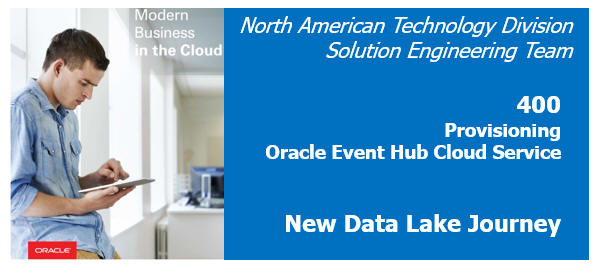  
Updated: June 19, 2017

## Introduction

This lab will walk you through provisioning an instance of **Oracle Event Hub Cloud Service (OEHCS)**.  

Oracle Event Hub Cloud Service combines the open source technology Apache Kafka with unique innovations from Oracle to deliver a complete platform for working with streaming data.

Apache Kafka provides a distributed streaming data platform.  A Kafka platform is a cluster of one or more servers called nodes that store streams of records (messages) in categories called topics.  There are 3 key capabilities inherent in Kafka:
 - It lets you publish and subscribe to the streams of records, in some ways similar to an email system
 - It stores these streams of messages in a fault-tolerant way
 - It allows for processing of these message streams as they occur

The Oracle Event Hub Cloud Service is a managed Platform as a Service (PaaS) cloud-based offering that provides a highly available and scalable messaging platform for loading and analyzing streaming data. You can:

 + Spin up multiple clusters and create topics in seconds, on demand, and then use it.
 + Scale Out or Scale In clusters or Add/Remove partitions to elastically react to varying demands of your streaming data.
 + Choose different cluster configurations depending on your needs.
 + Use open REST APIs and CLIs to manage, use, and extend the service.

Documentation for OEHCS can be found here: <http://docs.oracle.com/cloud/latest/event-hub-cloud/index.html>.  General info about Apache Kafka can be found here: <https://kafka.apache.org/>.

Please direct comments to: David Bayard (david.bayard@oracle.com)

## Objectives

- Learn how to provision an instance of the OEHCS Platform
- Learn how to create topics for your OEHCS Platform

## Required Artifacts

- Access to the Oracle Cloud My Services Dashboard with entitlement/quota to create an OEHCS instance

# Provision the OEHCS Platform instance

The "OEHCS Platform" represents a scalable cluster that runs OEHCS.  You can create a single instance of the OEHCS Platform, and then define multiple Kafka topics that run against this platform instance.

The "OEHCS Platform" is also sometimes referred to as "OEHCS Dedicated" because it is a dedicated cluster to your account.

## Create a new OEHCS Platform Instance

### **STEP 1**: Connect to the Oracle Cloud My Services Dashboard 

- 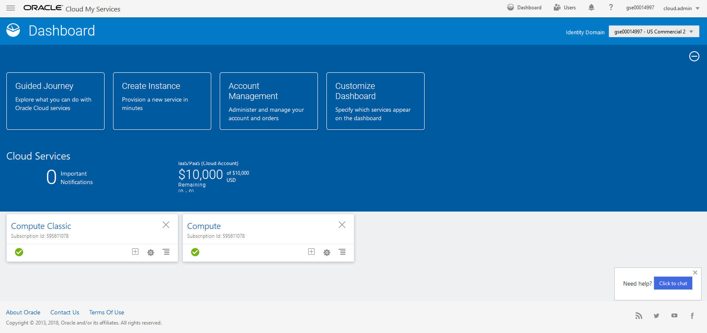 

### **STEP 2**: Navigate to the Event Hub - Dedicated page

- 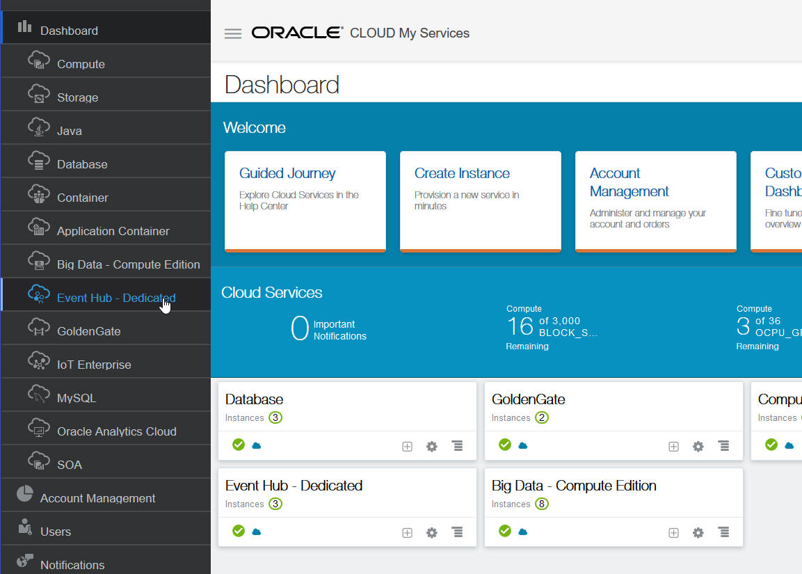  

### **STEP 3**: Click the Create Service button

- 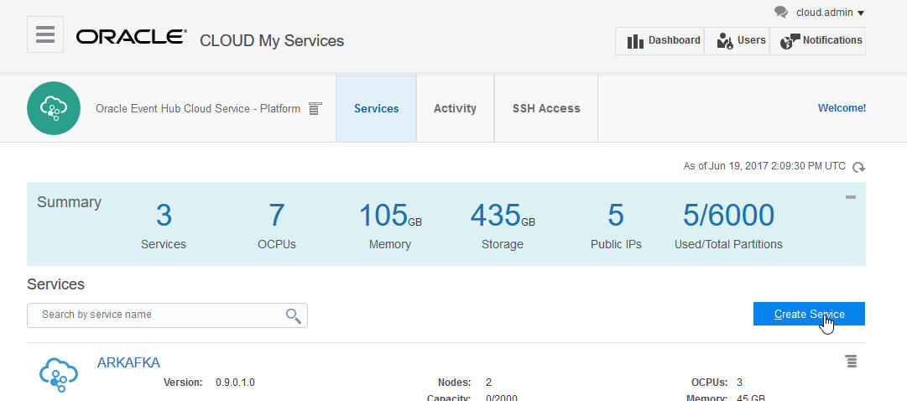 

### **STEP 4**: Fill in the basic service details and click Next

- 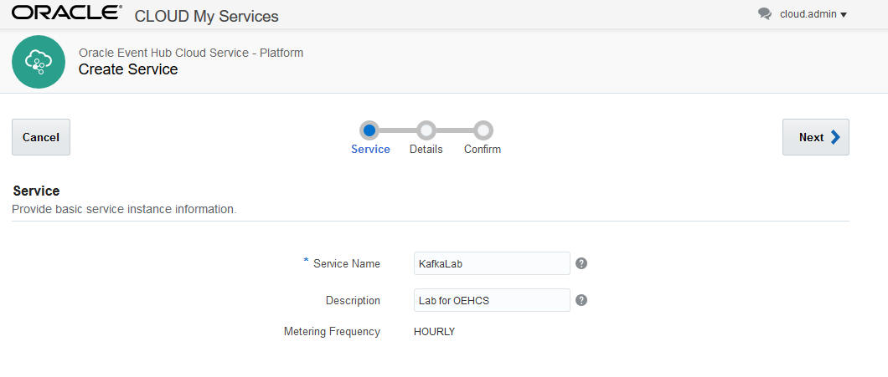 

### **STEP 5**: Fill in the additional service details and click Next

- Deployment Type: Choose Basic, which uses the least resources and is typical for development and test.
- SSH Public Key: You can use an existing key or create a new one.  Refer to the BDCS-CE or OEHCS documentation for more about working with SSH keys.
- Number of Nodes: Choose 1 for this lab.
- Compute Shape: Choose the smallest shape as that is all that is needed for this lab.
- Enable Rest Access: You can leave it unchecked as you don't need REST access in this lab.

- 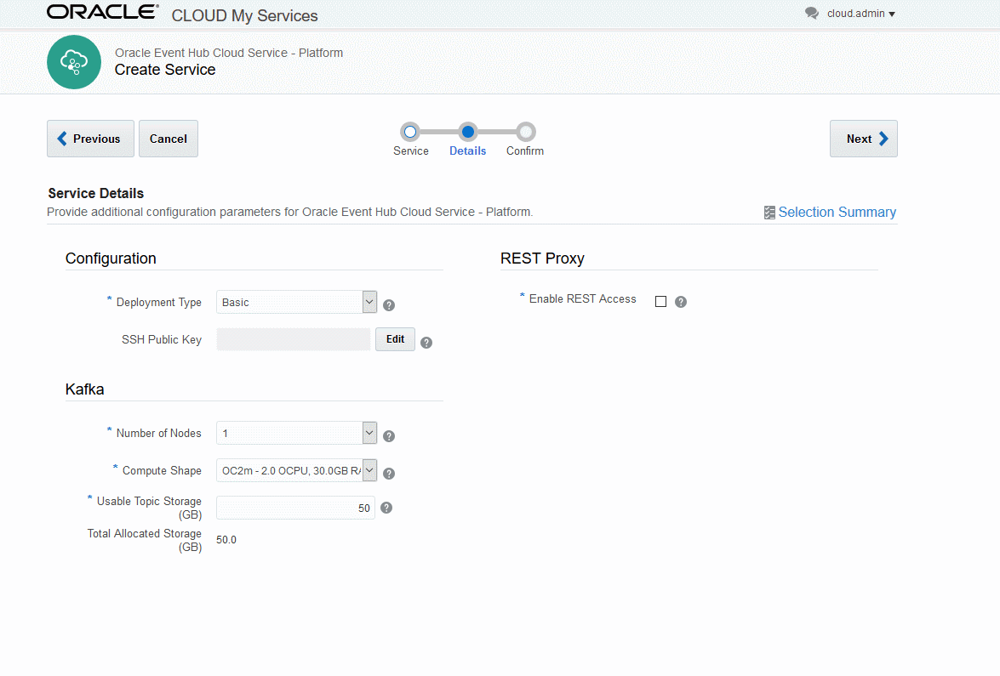 

### **STEP 6**: Click the Create button on the confirmation page to start the OEHCS Platform provisioning

- Provisioning will now begin.  It can take 10 minutes for it to complete.

- 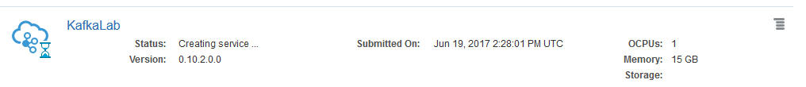 

### **STEP 7**: Once provisioning is completed, click on the name of the instance to go to the Service Overview page

- After provisioning is completed, the Service Overiew page has useful information including the **Connect Descriptor**.  You will use the Connect Descriptor later in the lab exercises.
- 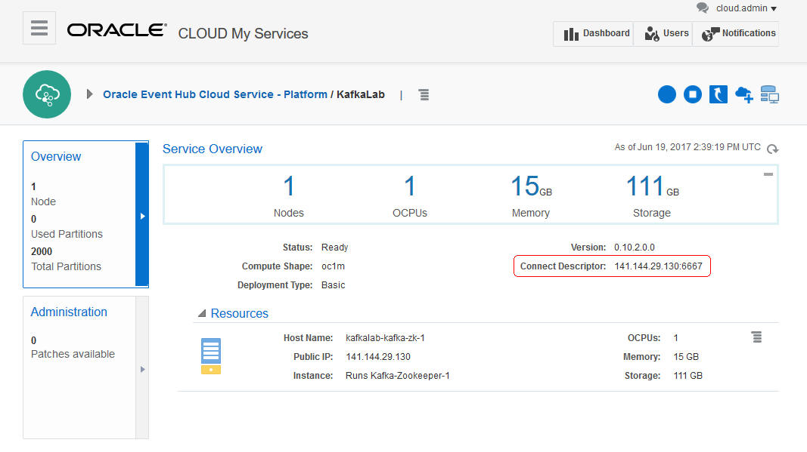 

# Create your first OEHCS topic

In this section, we will create a new Kafka topic in OEHCS.  Before we do so, a quick comment about OEHCS terminology.  The "OEHCS Platform" is the terminology for your dedicated OEHCS cluster.  A cluster will manage multiple topics.  We refer to individual topics as instances of "OEHCS".  Thus, to create a new topic you will create a new instance of "OEHCS" to run on the "OEHCS Platform" (dedicated cluster) you already created.

## Navigate to the Oracle Event Hub Cloud Service (via the OEHCS Platform page)

### **STEP 1**: Pop-up the main navigation menu (using the icon in the upper left) and select Oracle Event Hub Cloud Service - Platform

- **Hint**: You may need to navigate away to another service (such as BDCS-CE) and then navigate back in order to return to the top-level OEHCS-Platform page.
- It may be labelled Oracle Event Hub Cloud Service - Dedicated in certain releases 

- 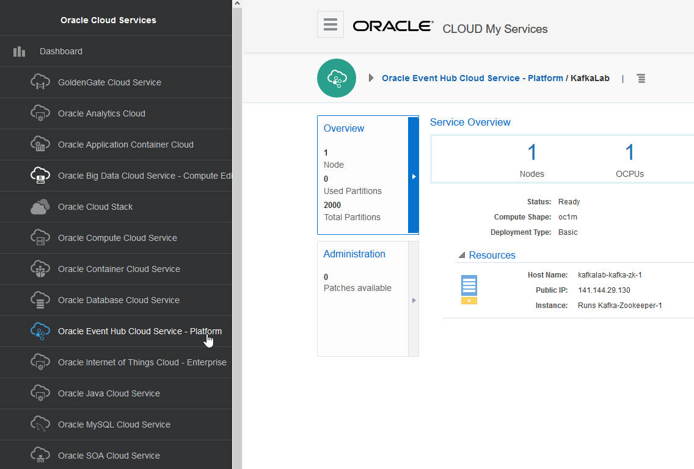 

### **STEP 2**: From the top-level OEHCS Platform page, use the pop-up menu (to the right of the OEHCS - Platform label) to navigate to the "Oracle Event Hub Cloud Service"

- 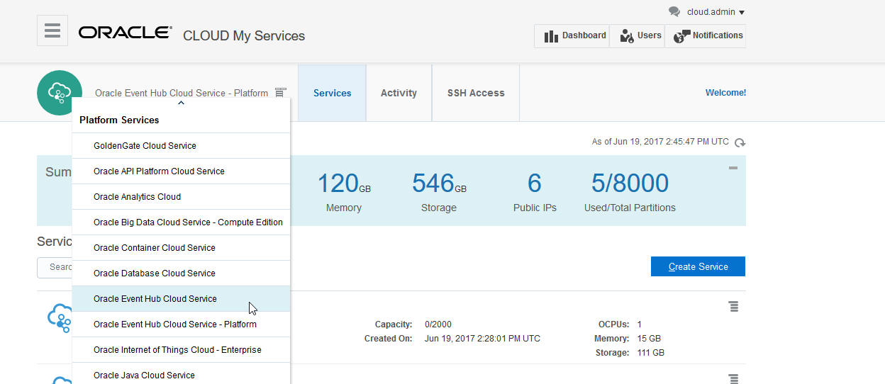 
- If this seems confusing, it helps to remember the distinction between "OEHCS Platform" which represents a dedicated Kafka cluster and "OEHCS Topics" which represent individual Kafka topics.  In other words, you have navigated from the screen where you manage the cluster itself (the "Platform" page) to where you will manage the individual topics you want to use.

## Create your first OEHCS Kafka topic

### **STEP 1**: In the Oracle Event Hub Cloud Service page, click on the Services tab if it is not already selected.

- 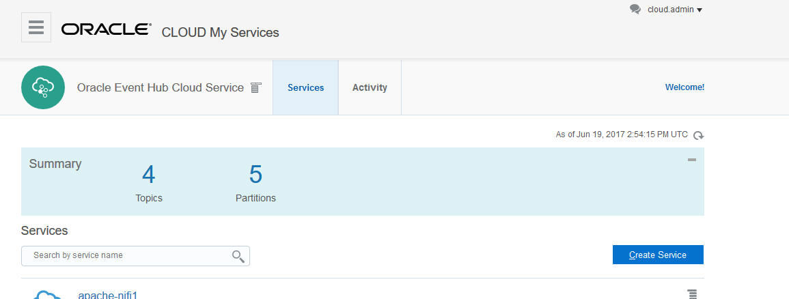 

### **STEP 2**: Click the Create Service button

### **STEP 3**: Fill in the details for your topic and click Next

- Service Name: enter a name like FirstTopic.
- Hosted On: Select the name of the OEHCS Platform instance you created earlier. 
- Partitions: Choose 1 for this exercise.
- 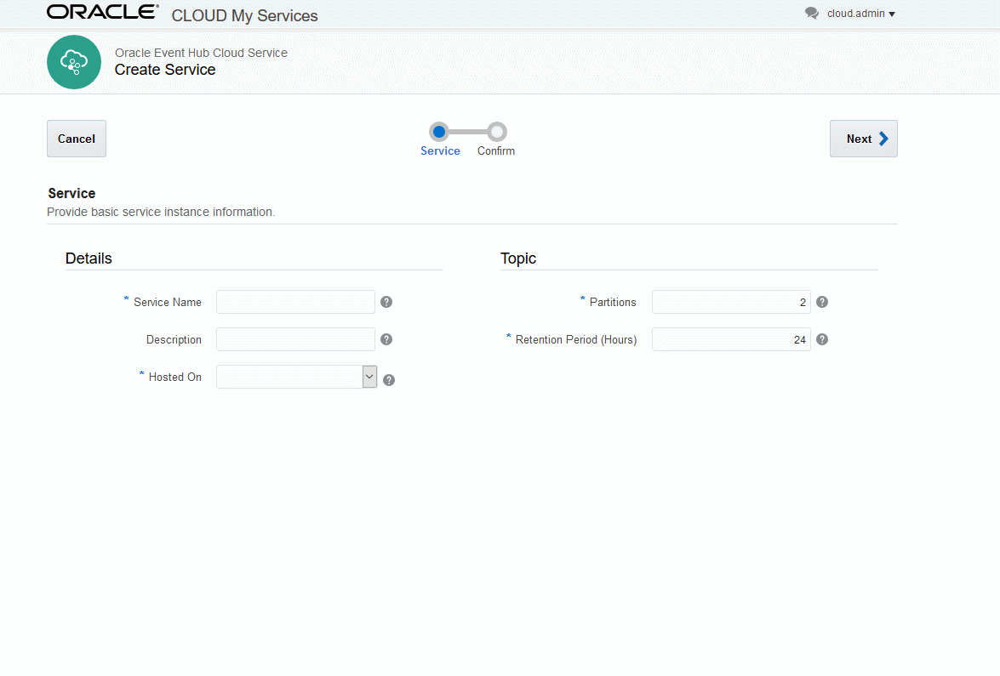 

### **STEP 4**: Click Create to complete the wizard.

- The topic will be created.  It will take a few seconds for the first partition to appear.

### **STEP 5**: Click on the topic name to pop-up some additional details about your topic, including the full topic name.

- Specifically, it will show you the full name of your topic.  The full name will have your identity domain prefixed to the topic name.  You will need to use the full topic name is your consumer and provider code.

- 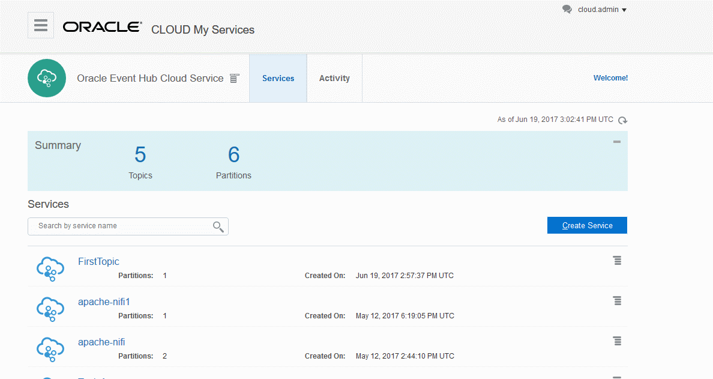  

# What you Learned

- Learned how to provision an instance of the OEHCS Platform
- Learned how to create topics for your OEHCS Platform

# Next Steps

- Proceed to the next Lab to learn how to add Oracle Event Hub Cloud Service to the our Lab architcture and how to leverage Spark Streaming