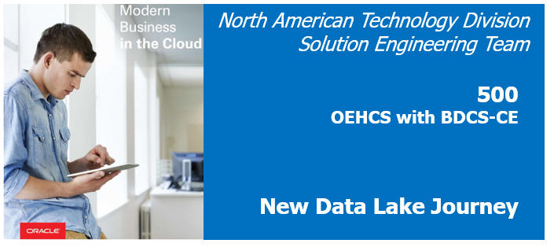
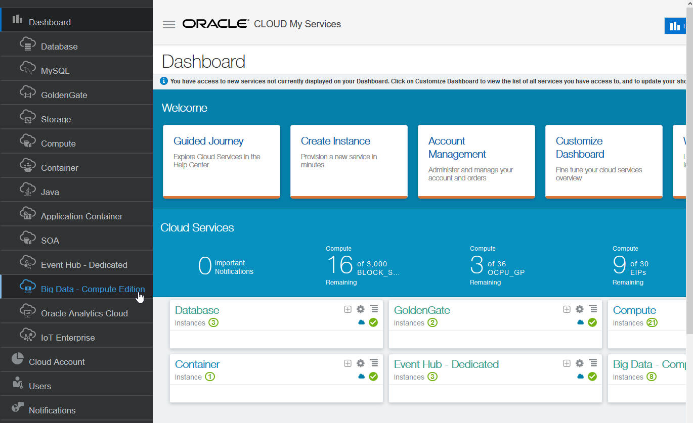
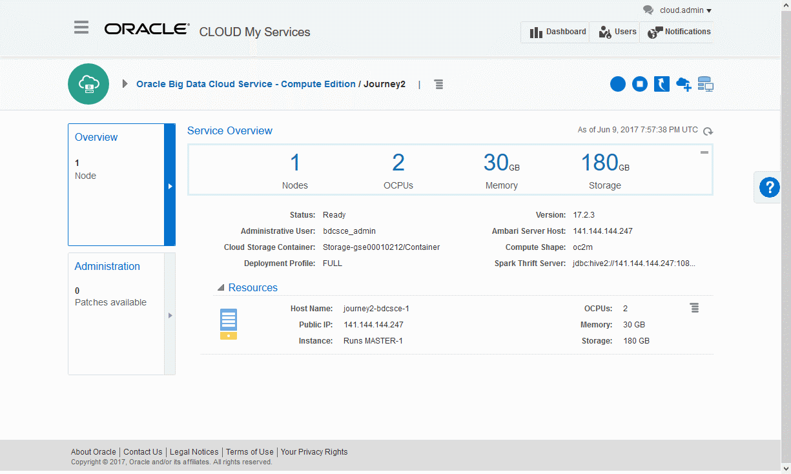
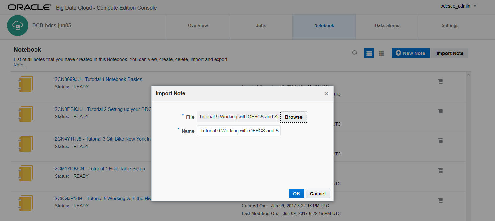
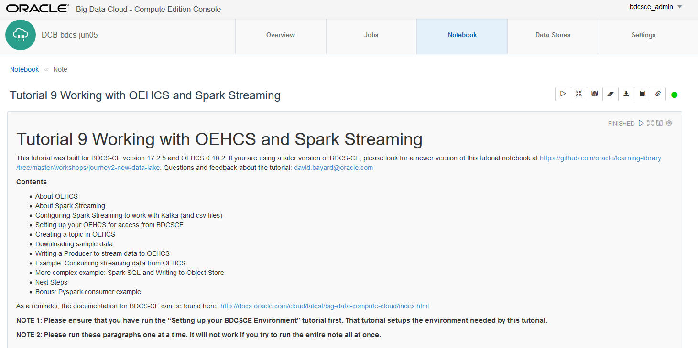
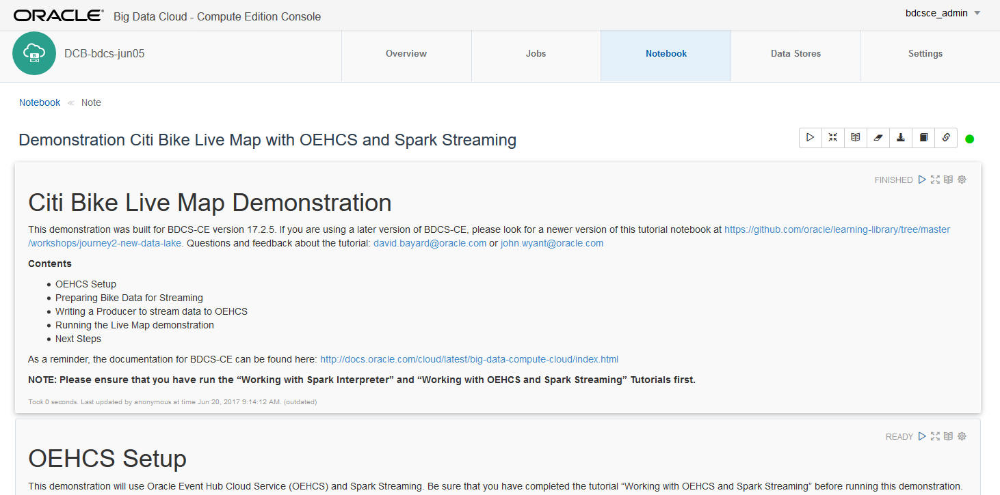

  
Updated: June 19, 2017

## Introduction

In this lab, you will learn how to steam data into **Oracle Event Hub Cloud Service (OEHCS)** and process it with **Spark Streaming** on **Oracle Big Data Cloud Service - Compute Edition (BDCS-CE)**.  

Oracle Event Hub Cloud Service combines the open source technology Apache Kafka with unique innovations from Oracle to deliver a complete platform for working with streaming data.  Documentation for OEHCS can be found here: <http://docs.oracle.com/cloud/latest/event-hub-cloud/index.html>.  General info about Apache Kafka can be found here: <https://kafka.apache.org/>.

The integration between OEHCS and BDCS-CE leverages Spark Streaming to easily process the live streams of data from OEHCS.  In particular, while Spark Streaming can work with multiple types of sources, we will be using Spark Streaming's support for Kafka as OEHCS leverages Kafka internally.  Documentation about Spark Streaming can be found here: <http://spark.apache.org/docs/1.6.1/streaming-programming-guide.html>.  And the integration with Kafka here: <https://spark.apache.org/docs/1.6.1/streaming-kafka-integration.html>

Please direct comments to: David Bayard (david.bayard@oracle.com)

## Objectives

- Learn how to setup OEHCS to communicate with BDCS-CE
- Learn how to create a topic in OEHCS
- Learn how to write a producer to stream data to OEHCS
- Learn how to consume data from OEHCS with Spark Streaming
- Learn how to use Spark SQL with streaming data
- Learn how to write streaming data to the Object Store
- Learn how to use streaming data to update a Live Map

## Required Artifacts

- A running BDCS-CE instance and a running OEHCS instance (as created in the previous Labs)
- Zip file of lab tutorials for the BDCS-CE Notebook, which can be downloaded from here: [Lab500Tutorials.zip](files/Lab500Tutorials.zip)

# Import the tutorial notes into the BDCS-CE Notebook

## Download the Tutorials zip file for this lab

### **STEP 1**: Download the Tutorials zip file 

- Download the Tutorials zip file from here: [Lab500Tutorials.zip](files/Lab500Tutorials.zip)

### **STEP 2**: Unzip the Tutorials zip file

- Unzip the tutorials file on your workstation.  There should be a number of files with .json extensions.

## Connect to the BDCS-CE Console

### **STEP 1**: Navigate/login to the Oracle Cloud My Services Dashboard  

-  

### **STEP 2**: Navigate to the My Services page for your BDCS-CE cluster

-   

### **STEP 3**: Launch the Big Data Cluster Console

- Launch the Big Data Cluster Console for your BDCS-CE cluster.  If this is your first time, you will likely need to allow your browser to accept the self-signed certificate for the web console application.
- You will be asked to provide a username/password.  Use the username and password you defined earlier when you created the BDCS-CE instance (the username defaults to bdcsce_admin).  If you are an Oracle Employee/Partner using a GSE "deal server" pre-provisioned environment, the un/pw will be set to bdcsce_admin/Welcome321
  

## Import the Tutorial Notes into the BDCS-CE Notebook

### **STEP 1**: Navigate to the Notebook tab  

### **STEP 2**: Click Import Note.  Browse your workstation to import the "Working with OEHCS and Spark Streaming" tutorial .json file.

- The .json files were downloaded and unzipped earlier in this lab.

- In addition, there are some demonstration notes you can import as well.

# Work with OEHCS and Spark Streaming

## Open and run the "Working with OEHCS and Spark Streaming" Tutorial note in the notebook

### **STEP 1**: Click on the Notebook tab.  Then click on the "Working with OEHCS and Spark Streaming" Tutorial to open it. 

-  

### **STEP 2**: Read and follow the instructions in the Tutorial

- The paragraphs of the note are displayed. 

Please walk through the paragraphs one by one. Read through the content of the paragraphs as you get to them. There is much useful information in the paragraphs that is not reproduced into these instructions.

**Pay attention to the instructions in the Tutorial note.  They will ask you to do a few steps outside of the notebook.  These steps need to be completed for the remaining steps to work properly.**

# Run the Citi Bike Live Map Demonstration

## Import, open, and run the "Demonstration Citi Bike Live Map with OEHCS and Spark Streaming" note in the notebook

### **STEP 1**: Navigate to the Notebook tab  

### **STEP 2**: Click Import Note.  Browse your workstation to import the "Demonstration Citi Bike Live Map with OEHCS and Spark Streaming" .json file.

- The .json files were downloaded and unzipped earlier in this lab.

-  

### **STEP 3**: Read and follow the instructions in the Demonstration note.

- The paragraphs of the note are displayed. 

Please walk through the paragraphs one by one. Read through the content of the paragraphs as you get to them. There is much useful information in the paragraphs that is not reproduced into these instructions.

-  

# What you Learned

- Learned how to setup OEHCS to communicate with BDCS-CE
- Learned how to create a topic in OEHCS
- Learned how to write a producer to stream data to OEHCS
- Learned how to consume data from OEHCS with Spark Streaming
- Learned how to use Spark SQL with streaming data
- Learned how to write streaming data to the Object Store
- Learned how to use streaming data to update a Live Map

# Next Steps

- Experiment with your own data