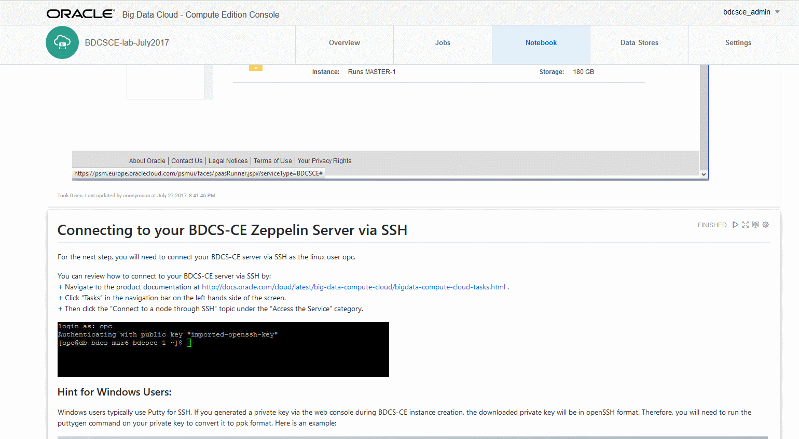
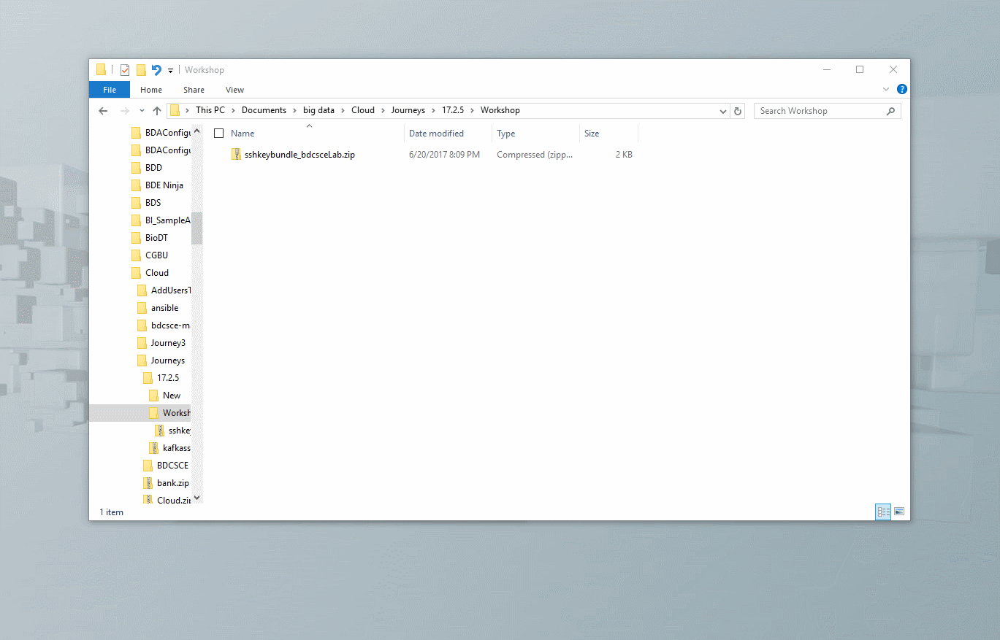
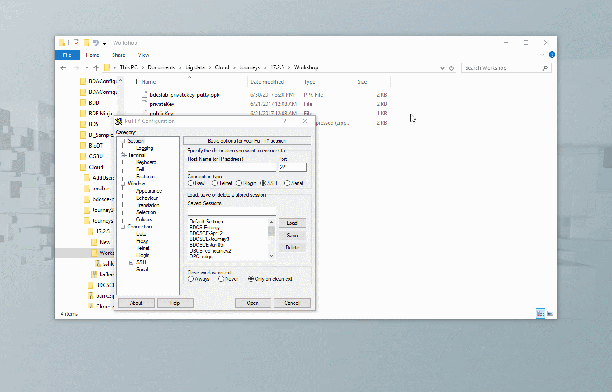
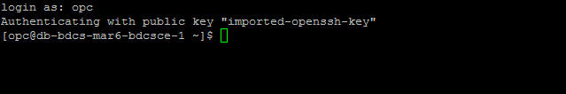

# Instructions to run the bootstrap.sh script manually

Updated: March 9, 2018

## Introduction

The New Data Lake journey provides instructions in [Lab 100 Start Here](LabGuide100StartHere.md) that specify a bootstrap.sh script to use when the BDCS-CE instance is provisioned.  This bootstrap.sh does a number of key configuration steps for the journey, including populated the needed Zeppelin notebooks.

While we recommend you follow the Lab100 instructions, this document provides instructions on how to do run the bootstrap script manually.

# Steps

## Open up network Access to your BDCS-CE instance for SSH (OCI-Classic)

Our first step is to enable network access to our BDCS-CE server via the SSH protocol.  You will do this from the BDCS-CE Service Console.  Here are the steps (these steps are for OCI-Classic.  For OCI, SSH ports should already be open by default):

 + From the BDCS-CE Service Console, navigate to Access Rules for your BDCS-CE instance.  

 + Then, on the Access Rules page, enable the ssh (port 22) access rule by choosing Enable from the clickable menu under the Actions column as shown below.

## Connect via SSH

Now that the network access is setup, we will proceed to connect to the BDCS-CE server via SSH.  

If you do not know how to connect to BDCS-CE via SSH and private keys, you can review the documentation here:

+ Navigate to the product documentation at <http://docs.oracle.com/cloud/latest/big-data-compute-cloud/bigdata-compute-cloud-tasks.html> .  
+ Click “Tasks” in the navigation bar on the left hands side of the screen.  
+ Then click the “Connect to a node through SSH” topic under the “Access the Service” category.

### Instructions for Windows Users: 
Windows users typically use Putty for SSH.  If you generated a private key via the web console during BDCS-CE instance creation, the downloaded private key will be in openSSH format, which can not be used directly with Putty.  Therefore, you will need to run the puttygen command (which gets installed with Putty) on your private key to convert it to ppk format.  Here is an example:

Next, Windows users will specify the location of the private key (in .ppk format) when connecting.  Here is an example:

## Connect now via SSH to your BDCS-CE Master Server.  Use the private key and connect as the user opc

## Now run these commands (hint: in putty, right-click does a paste)
When you run this, it will take a few minutes so please be patient.

    sudo bash
    wget -nc https://github.com/millerhoo/journey2-new-data-lake/raw/master/workshops/journey2-new-data-lake/files/100/bootstrap.sh
    chmod u+x bootstrap.sh
    ./bootstrap.sh
    echo "done"

## If you have a multi-node cluster, repeat these steps on each node.
If you have more than 1 node in your cluster, repeat these steps for the other nodes.

## Begin Your Big Data Journey

Return to the instructions in [Lab200](LabGuide200.md) and start with Tutorial 1. 
